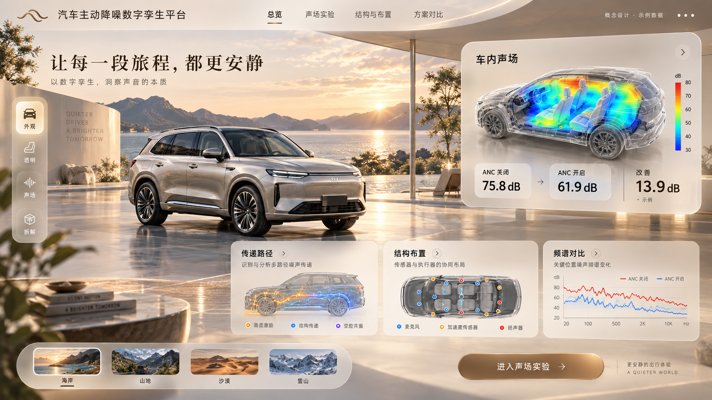
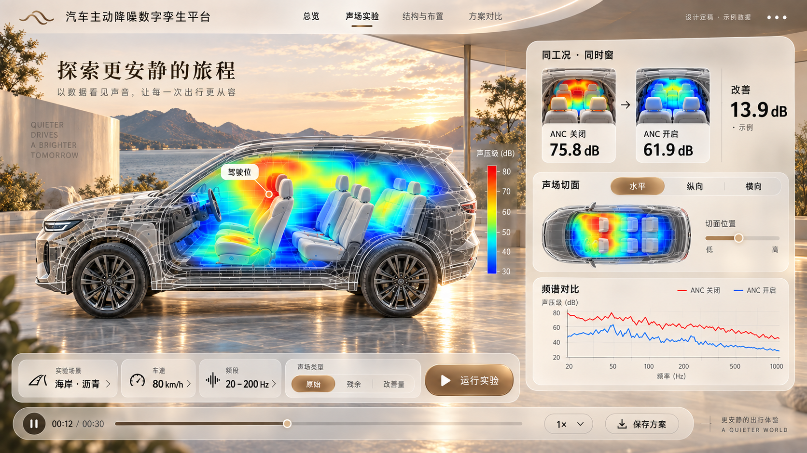
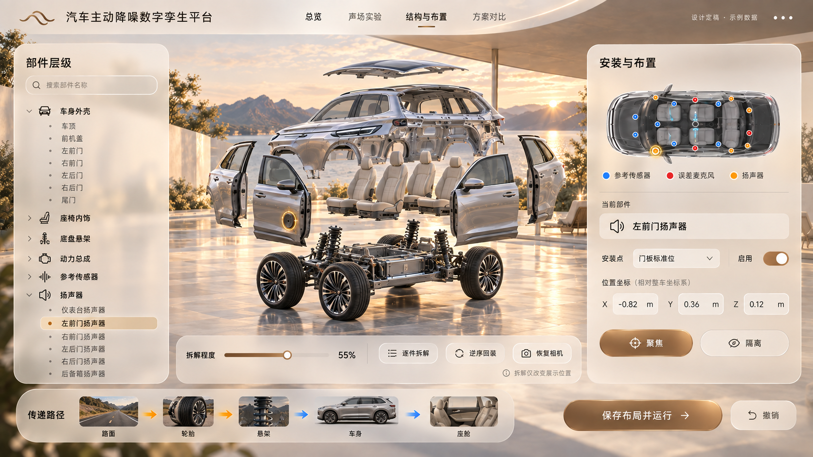
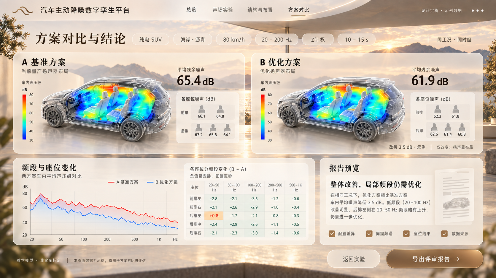

# 最终展示形态与设计入口

用户于 2026-09-30 确认 **E 云境香槟** 为最终展示形态。湖畔夕阳展厅、银色 SUV、暖白玻璃面板、香槟主按钮、四个导航和首页构图以本页母版为准。历史赛博风与多风格探索不再作为默认开发目标。

设计方向已确认；正式产品仍在实现中。本目录不会自动替换应用，也不代表四车型、同车声场或最终设备验收已经完成。

## 设计与执行入口

- [完整团队分工与资源集成方案](../plan/12_CHAMPAGNE_IMPLEMENTATION.md)：第一性原理、事实盘点、模块复用、接口、任务顺序、验收和风险。
- [UI 和交互规格](champagne-final/UI-INTERACTION-SPEC.md)：四页布局、点击行为、状态、组件和响应式。
- [设计变量](champagne-final/design-tokens.json)：主题色、文字、间距、圆角和动效。
- [原型源码](champagne-final/index.html)：下载仓库后双击打开；GitHub 文件页仅展示源码。
- [下载可直接打开的设计包](https://github.com/KnowCooker/RNC_3D_SIMULATION/releases/download/design-review-2026-09-29/RNC-champagne-final-design-2026-09-30.zip)：解压打开 index.html，可切页、打开浮层和查看交互标注。
- [设计检查记录](champagne-final/QA.md)与[文件清单](champagne-final/MANIFEST.json)。

发布包 E-FINAL-1.0 为设计定稿快照，SHA-256：`da348486398b89ea2566fef1536106fa007e12d69e178d67777eb6eb80a0b91c`。本仓库保存同一份设计文件；团队执行方案以本仓库最新 main 为准。

## 总览母版

以下图片直接来自用户批准的附件，未经重绘，哈希见清单。布局及内容是最终视觉验收依据；图上的热图与数字为设计示例，生产版本从有效计算数据生成。

## 声场实验页面

保持同一环境和车辆身份，主舞台放大座舱声场，提供同窗原声与残余、三向切片、探针、频谱、工况和统一回放。

## 结构与布置页面

部件树、同车可逆拆装、安装点与启用状态、路径说明分层展示。拆装只改变显示坐标。

## 方案对比页面

同条件比较、差异说明、频段和座位结果、来源与报告入口集中展示。视觉方向已确认，子页是本轮延展设计，不冒称用户逐页签收。

## 实施时必须保持的含义

页面必须成为真正可操作的 HTML 控件、三维模型和数据视图。不要把整张图铺成背景后把热点点击当成最终产品。图片中的车不是已经就绪的 GLB；现有写实资产也不自动等同于图中车型。不能用固定图片、四个麦克风插值或固定 13.9 dB 填补尚未接通的计算。

完整功能继续遵守[完整目标](../plan/10_FULL_GOAL.md)和[A组最终交付](../coordination/A_FINAL_DELIVERY.md)。本次视觉确认保留四动力 SUV、同车几何、真实教学计算、合理解释、离线运行和可接续协作要求。
