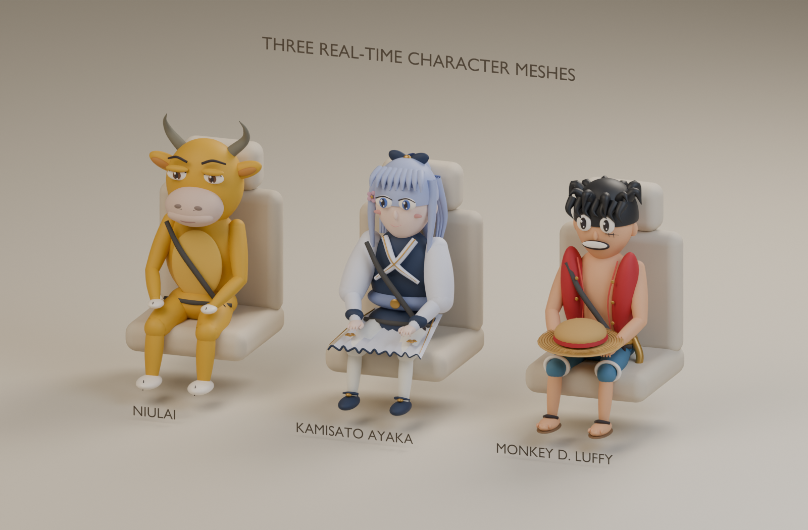
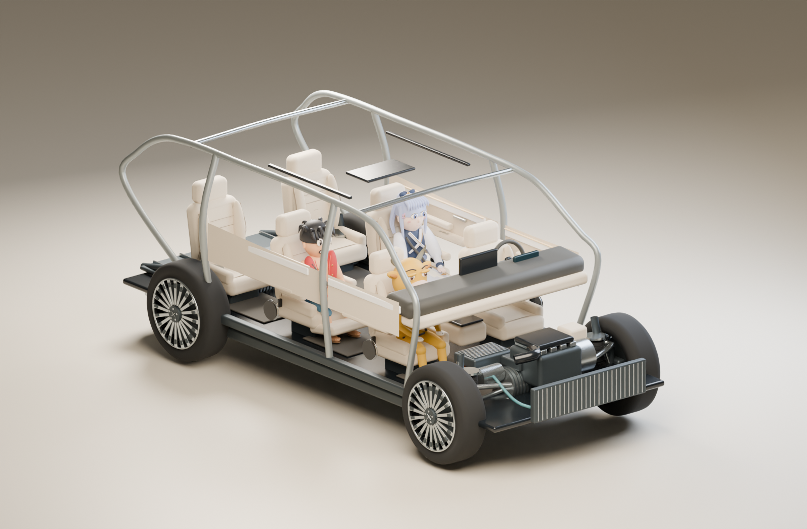

# 同行伙伴 · 三维乘客初版

2026-10-07 · Role: A1 · Task: A1-FULL-021 · Identity-Source: user-declared · Executor: Codex

三位角色已经以真实网格接入正式 lab-v3 的「同行伙伴」入口。牛来依据本次用户图片重做为黄色小牛；绫华与路飞沿用各自辨识特征。本轮为**卡通程序建模初版**，不是官方模型，也未达到上一轮精细角色概念板的材质和面部精度。人物只参与视觉显示，未加入人体吸声或改变声学计算。

上图由实际运行模型导出的 GLB 经 Blender 离线渲染。展台座椅为审阅道具，灯光、渲染器与浏览器不同；不是正式页面截图。

## 如何使用

从仓库根目录运行 `pnpm dev --port 5190 --strictPort`，打开 `http://127.0.0.1:5190/`。当前运行页使用 lab-v3，不是 `dev:a` 历史回放。

1. 点击车型旁的 **同行伙伴**，进入去壳座舱视角。
2. 点击座位，再点击牛来、神里绫华或路飞，即时安排该座乘客。
3. **三人同行**在前三个乘客位各安排一位角色，其余留空；**此座留空**和**全部清空**分别清空单座与整车。
4. **近看此座**聚焦选中座位；**整舱视角**恢复全舱。可继续拖动三维视图。
5. **显示车内乘客**只控制可见性，选座配置保留。关闭抽屉或切换主导航退出选座界面。

每个乘客位可独立选任一角色，允许重复。主驾保留，不属于乘客位。五款现有小鹏模型从实际座椅生成布局，乘客数为车辆总座位数减一；换车时恢复该车在**本次会话**的配置，初始全部空座，刷新页面不会保留。尚未为历史 Range Rover/Tesla 外观参考及四类动力通用教学网格建立乘客挂点。

## 角色与资产

| 角色 | 本次形象 | 网格三角数 | 材质合批后的 Mesh 数 |
| --- | --- | ---: | ---: |
| 牛来 | 黄色小牛、灰色弯角、半睁眼、浅色宽口鼻、白色蹄 | 57,976 | 22 |
| 神里绫华 | 银蓝刘海与马尾、蓝白衣装、金色边饰、发花 | 94,428 | 21 |
| 路飞 | 黑发、眼下疤痕、红背心、蓝短裤、膝上一顶草帽 | 88,948 | 26 |

网格规模是几何审计，不能当作目标设备的帧率证明。人物采用坐姿刚性头/眼层级，随统一播放时间进行轻呼吸、眨眼和轻微转头；暂停保持同一帧，减少动态时恢复中性姿态。目前没有骨骼蒙皮、口型、语音或布料模拟。

- [牛来 GLB](models/niulai.glb)、[神里绫华 GLB](models/ayaka.glb)、[路飞 GLB](models/luffy.glb)：可供后续 DCC 编辑的静态坐姿交换文件。
- GLB 保留几何、节点、材质颜色/粗糙度；省略程序微纹理和运行时动画函数。生产运行仍直接创建同源 Three.js 网格与微纹理，不请求这三份交换文件。
- [用户牛来参考图](reference/niulai-user-reference.png)为原文件复制；图中文字仅作来源上下文，不据此声明电影资料。
- [几何审计](models/geometry-audit.json)、[文件清单](MANIFEST.json)、[实际验证](QA.md)。

此图导出的是生产程序的 GX 座舱与真实挂点。隐藏车壳后保留结构，牛来在副驾、绫华和路飞在第二排；它验证同源姿态，不能替代浏览器材质、移动端操作与所有座位视角的人工验收。

## 代码与团队衔接

- A1：`src/team-a/lab/passenger-state.ts` 维护按车型隔离的视觉状态；`passenger-panel.ts/.css` 维护香槟抽屉及无障碍标签；`champagne-shell.ts` 负责入口、导航和切车完成后的座舱视角恢复。
- 本轮用户授权的 viewer 接入：`passenger-model.ts` 创建/动画/裁切/释放；`passenger-cabin.ts` 读取 `seat-r-c/contoured-seat-cushion` 实际挂点，排除 `seat-1-1`，人物成为对应座椅的子节点，拆装时随座位移动。
- viewer 保持新增接口 `passengerSeats`、`passengerAsset`、`setPassengers`、`setPassengersVisible`、`focusPassengers` 和 `passenger-layout-change`；不改 `LabConfig`、Worker、B 引擎、数值结果身份或声学安装点。
- A2 后续可独立替换 `createPassengerModel` 为精细骨骼资产，保留上述实例接口、角色 ID、+Z 朝前/髋部原点约定和资源释放责任；不必重做 A1 选座状态。接续前仍查询 #59 与 A2 开放任务，不能据本设计自动视为新任务已认领。
- 需要继续提升：面部/头发/衣饰与参考形象的精度，骨骼与自然坐姿，不同车型头枕/膝部/仪表台净空的人工检查，目标 GPU 绘制/长稳测试。当前只自动验证整体头顶与地板范围，未作逐三角碰撞检测。

## 重建与验收边界

在仓库根运行 `pnpm exec tsx docs/design/passengers-3d-v1/export-models.mts` 重新导出模型。使用 Blender 4.5.9 执行 `blender --background --python docs/design/passengers-3d-v1/render-models.py` 生成两张离线图；GX 中间 GLB 和 Blender 项目存于未上传的 `output/passenger-render/`。没有改系统安装或项目依赖。

正式浏览器打开操作被自动审批以 URL 协议策略拒绝，因此**本轮正式页面截图、触控、720p/手机布局及实时帧率未验收**。详情见 QA；不要将离线图或代码测试替换成页面验收结论。
