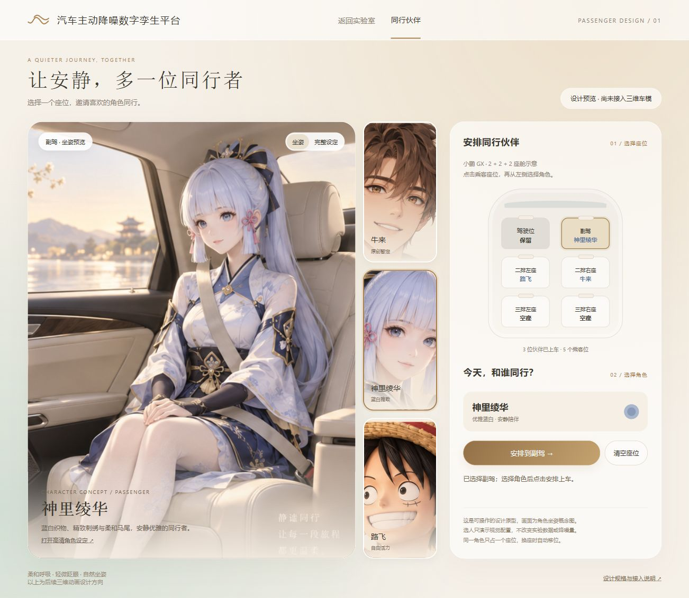

# 二次元乘客 / 首版角色与选座设计

> **2026-10-07 已归档：牛来人形暂定稿作废。** 用户已确认牛来为黄色小牛，正式三维实现、GLB、同源离线渲染与选座规范见[三维乘客初版](../passengers-3d-v1/README.md)。本目录仅保留 10 月 6 日历史概念；旧原型移除错误牛来选项，历史 PNG 不再作为当前人物依据。生产交互已改为每个乘客位独立选择，允许重复角色，以新规范为准。

2026-10-06；Role: A1；Task: A1-FULL-021；Identity-Source: user-declared；Executor: Codex。沿用最终「云境香槟」方向，不改变声学实验主线。

本包是角色概念与交互设计，**不是已经接入运行应用的3D人物资产**。内置 image_gen 生成 PNG；`prompts.json` 保存完整提示词及路飞单草帽修正提示。原图留存，项目内复制选定结果。

## 三位角色

| 角色 | 视觉方向 | 乘车设计 |
| --- | --- | --- |
| 牛来（原创暂定） | 短牛角、可可棕发、琥珀眼、薄荷绿夹克与深色长裤 | 角不触顶，手置腿面，三点安全带，温暖可靠 |
| 神里绫华 | 蓝白/浅金、马尾、织物刺绣与精致发饰 | 双手自然放在膝上；头发、衣摆在后续绑定中避开头枕、安全带与车门 |
| 路飞 | 黑发、左眼下疤痕、草帽、红背心、蓝短裤 | 草帽放膝上、露出黑发；放松坐姿，安全带跨肩与髋部 |

“牛来”的出处已询问但截至出稿未明确；此稿明确为原创牛角青年暂定案，不擅自声称是某个已有角色。确认名称/出处后只替换该角色资料与美术，座位交互保持。神里绫华与路飞为用户指定的既有作品角色，图为生成概念演绎，不是官方模型，也不声明已有商业IP授权。

角色板含全身、坐姿、面部与材质参考。游戏用模型必须另做一致的三视图/绑定与实机验证，不能直接把PNG当成可旋转人物；本轮未生成GLB、语音、眨眼或呼吸动画。

## 可点击原型

打开 `index.html`，或在当前本地服务访问 `/docs/design/passengers-v1/index.html`。依赖都在包内，无网络字体/库。GitHub文件页只显示HTML源码，需要下载整包或本地服务预览。

1. 先选择座位：以GX六座2+2+2示意，主驾在首版保留，提供五个乘客位。正式版按当前车型生成5/6/7座布局，不能套用固定GX布局。
2. 选角色：左侧预览坐姿；人物卡和当前占用分开，点击“安排到…”后才更新座位。可切完整设定图。
3. 一座一人，同一角色仅一处；再次安排同一角色会从旧座移至新座，替换当前乘客时明确反馈；可清空座位。
4. 初始副驾为绫华，其他乘客位为空。状态仅在本页内存中，刷新恢复初始设计，正式实验数据不受影响。

整体暖白玻璃/香槟按钮/留白，角色配色作为次级点缀。主舞台预览、侧边人物卡、右侧座位图与操作构成单一流程。键盘可选座/选人/安排/清空，状态有aria-live；窄屏上下排列。当前主舞台以SVG视窗对概念板原比例取景，并非实时3D座舱。

## 后续集成边界

- A1：在“结构与布置”加入乘客入口，维护独立视觉状态 `seatId -> characterId|null`，选人/移位/清空、换车型清理不存在座位、还原默认和本地偏好。不要塞入 `LabConfig` 数值参数，不借选角重置或伪造实验。
- A2：在现有同车座椅挂点上接入GLB骨骼人物、坐姿适配、安全带、裁剪/透明检视与拆装联动；每种车型、每个座位验证足底/髋/头部、发饰/草帽/衣摆的净空。后续任务要正式认领，不以本设计替另一端签收。
- 首版动画建议眨眼、轻呼吸、有限视线变化；随播放器暂停/减少动态设置静止，离屏停更；按需加载、几何/贴图预算及目标GPU验收在资产实现时制定。
- 声场仍使用原采样/麦克风与B引擎结果。乘客初版仅视觉，关闭人物时场值必须完全相同。若未来计算人体吸声/散射，另由B设计物理模型与验证，不能根据角色人设修改降噪量。
- 不加入武器、战斗技能、角色聊天或自动语音，避免遮挡模型/打断实验；这些不属于此次要求。

## 交付文件

- `assets/ayaka.png`：神里绫华角色板。
- `assets/luffy.png`：路飞修正版（坐姿只保留膝上一顶草帽）。
- `assets/niulai-provisional.png`：牛来原创暂定板。
- `index.html`：可点击交互原型；`prompts.json`：完整生成提示词；`MANIFEST.json`：选定图片字节与SHA256。

实际浏览器与工程检查记录见 `QA.md`。设计包单独保存，生产页面和当前实验不修改。

[手机纵向排版](screens/mobile.png)
