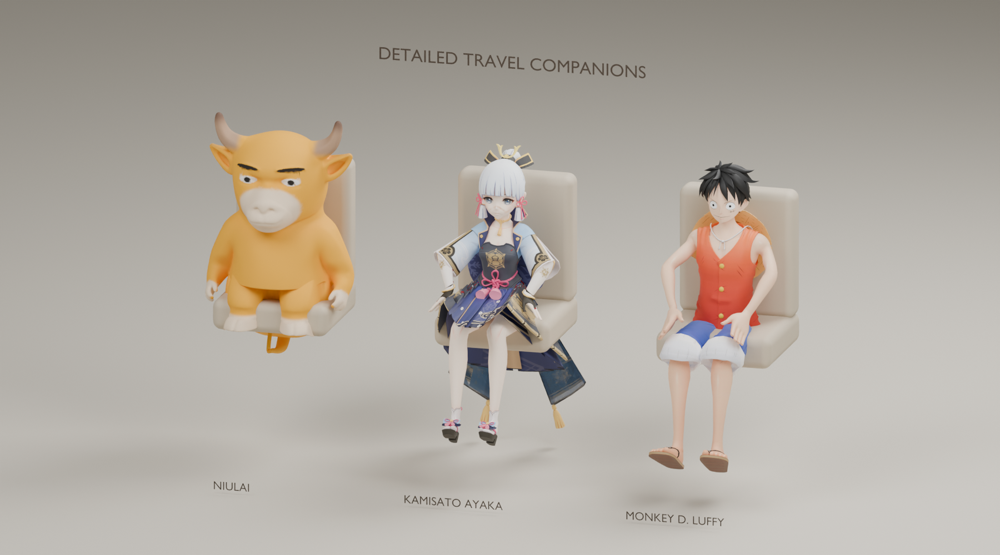
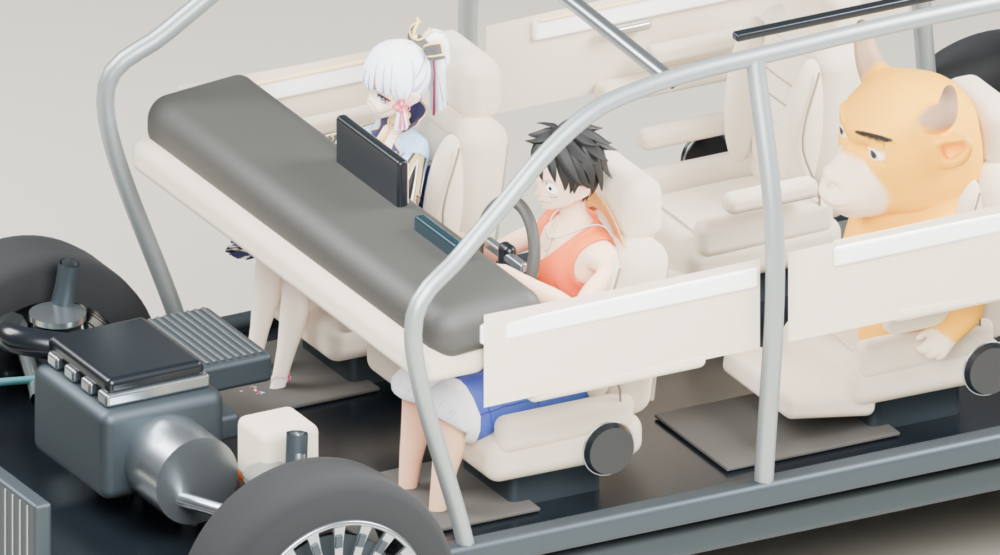

# 精细同行伙伴与主驾选座

2026-10-08 · Role: A1 · Task: A1-FULL-021 · Identity-Source: user-declared · Executor: Codex

后续已扩展为六位角色，乔巴/娜美/索隆、草帽同行及最新检查见 [v3 接续](../passengers-v3/README.md)。本页保留原三人资源复现说明；界面“三人同行”现名为“经典三人”。

本机已接入牛来、神里绫华、路飞的精细三维网格，每人提供乘客/驾驶两种坐姿。使用现成 `character-artist` skill 的比例、面部与服装整理流程，在 Blender 4.5.9 中处理真实模型，保留绫华与路飞原 UV 绘制纹理。牛来按黄色小牛参考使用雕刻网格，经连续曲面重建、平滑、减面及渐变色区处理。不是人物图片贴片，也不是云端生成服务的占位结果。





以上是安装 GLB 与生产车模/座椅坐标经 Blender 渲染的审阅图。展台图中的座椅是审阅道具；GX 图中的车舱是现有生产几何，使用同一 `passengerFit` 函数计算位置。灯光、离线渲染器与网页不同，**不是浏览器截图**。全舱图见 [GX 装车检查](renders/gx-seat-fit.png)。

## 当前使用

在本仓库运行 `pnpm dev --port 5190 --strictPort`，打开 `http://127.0.0.1:5190/`，从车型旁的 **同行伙伴** 进入。

1. 选择 **主驾**、副驾或任意后排座位，再点牛来、神里绫华或路飞。
2. 每个座位独立选择，允许重复同一角色；主驾会加载对应的驾驶坐姿。
3. **三人同行**依次安排牛来主驾、绫华副驾、路飞二排左座。空座/清空/近看此座/整舱视角与显示隐藏保留。
4. 等待状态提示 **精细模型已就绪**。加载期间显示基础模型；资源缺失会明确显示基础模式。清空再选择可重试资源加载。

适用于当前五款小鹏实验模型，按实际座椅生成 5/6/7 座布局。本次会话内按车型保存选座，页面刷新后不保留。人物随座椅拆装、裁切及显隐；独立材质防止重复角色互相污染；异步换人/切车/清空后旧响应不能把人物重新挂回。

## 本机资源与跨机接续

接入代码、转换/复核脚本和审阅图进入 Git；**第三方原包、贴图、六个转换 GLB 仅本机缓存，未上传 GitHub**。绫华包禁止二次配布及商用；路飞与牛来未确认模型再分发许可。完整来源见 [THIRD_PARTY.md](THIRD_PARTY.md)，原始 URL/版本及 SHA-256 见 [inputs.json](inputs.json)。新克隆缺少缓存时仍能运行基础人物。

获得适用授权的另一台开发机可以按以下流程从原始来源准备自己的本机审阅资源。脚本不授予角色/资产许可。正式公开或商用发布应换成可分发资产或取得相应授权。**Vite 会把 `public/passengers-local` 复制到本机 `dist`；含该缓存的 `dist` 不可直接作为公开部署包上传。**

Windows PowerShell，从仓库根运行（Python 3、Blender 4.5；本次工具为官方 4.5.9 便携版）：

```powershell
# 先阅读资源原始说明；--fetch 从原始地址获取缺少的文件，已有文件只做摘要检查。
python docs/design/passengers-v2/fetch-inputs.py --fetch
python docs/design/passengers-v2/prepare-inputs.py
$blender = 'output/tools/blender-4.5.9-windows-x64/blender.exe'
& $blender --background --python-exit-code 1 --python docs/design/passengers-v2/inspect-inputs.py
& $blender --background --python-exit-code 1 --python docs/design/passengers-v2/refine-assets.py
pnpm exec tsx docs/design/passengers-v2/export-cabin.mts
& $blender --background --python-exit-code 1 --python docs/design/passengers-v2/render-review.py
pnpm check
```

`fetch-inputs.py` 将 `public/passengers-local/` 写入该克隆的 Git 本地排除文件；不修改共管根配置。原始输入/中间 Blender 文件进入 `output/passenger-v2`，不要将整个 `output` 加入版本控制。转换输出是 `{niulai,ayaka,luffy}-{seated,driver}.glb`。`refine-assets.py -- niulai` 可以只重建牛来。默认验证本机输入可运行不带 `--fetch` 的检查。

## 精度与已知边界

| 角色 | 单坐姿三角形数 | 单 GLB 约大小 | 本批细节 |
| --- | ---: | ---: | --- |
| 牛来 | 141,496 | 4.25 MB | 连续雕刻曲面、双角/耳/口鼻、渐变色区、手臂坐姿 |
| 神里绫华 | 23,388 | 5.82 MB | 原面部/服装贴图、发片与发饰、裙摆、骨骼离线坐姿 |
| 路飞 | 28,822 | 3.18 MB | 原 UV 绘制材质、头发、衣装/凉鞋、背部草帽 |

运行时缓存同一角色/姿态的下载和纹理，各座独立几何/材质。GLTF 解析器按需加载，新增约 44.06 KB 原始 / 13.01 KB gzip 异步块；主入口约 582.43 KB / 227.15 KB gzip，既有大块提示仍在。六个模型本机合计约 26.48 MB；未将离线渲染耗时当作网页帧率。

人体模型是**离线骨骼调整后烘焙的静态坐姿网格**，网页仅有统一时间轻微呼吸位移并遵循减少动态设置；尚非完整人物动画/实时骨骼 IK。主驾可乘坐并使用抬臂姿态，未实现各车方向盘精确握持、手指接触求解、人物衣物碰撞。绫华长裙/长发和路飞背帽在部分座椅观察角度可能与椅背相交，不能把包络净空测试称作逐三角无穿插验证。

不修改声学配置、人体吸声或实验计算。公开发布的资产许可、真实页面与目标设备质量仍为后续验收项。验证明细见 [QA.md](QA.md)。旧 [三维初版](../passengers-3d-v1/README.md) 的主驾保留规则已被本版取代，基础网格作为缺资源回退保留。
