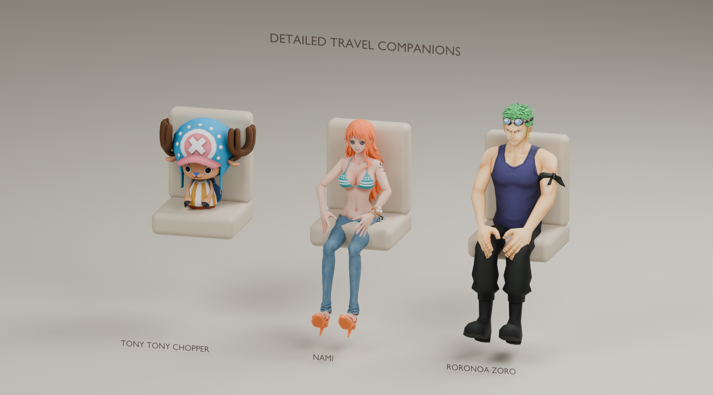
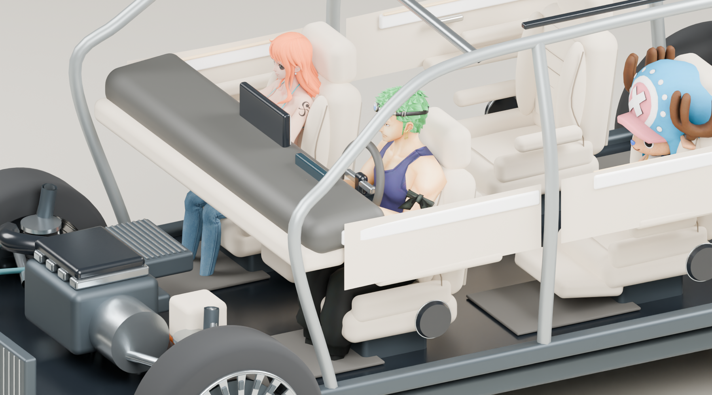

# 六位同行伙伴：乔巴、娜美、索隆扩展

2026-10-08 · Role: A1 · Task: A1-FULL-021 · Identity-Source: user-declared · Executor: Codex

在已有牛来、神里绫华、路飞基础上加入乔巴、娜美、索隆。六人都能坐在主驾、副驾或任意可用后排；每个座位可独立换人、重复角色或留空。主驾沿用已开放的实际座位挂点，新增三人分别提供驾驶/乘坐两份三维网格。





图来自本机安装 GLB 与 Blender 4.5.9。三人图的座椅是审阅道具，GX 图由当前生产车模及同一 `passengerFit` 挂点导出。灯光/渲染器与网页不同，**这些是离线实网格渲染，不是网页截图**。另见[全舱图](renders/gx-seat-fit.png)与[三种驾驶坐姿](renders/three-drivers.png)。

## 使用方式

在现有演示页的车型旁点 **同行伙伴**，选择 **主驾** 或其他座位，再点角色。面板包含六人独立头像，三列两行排列；小屏沿用滚动面板。

- **草帽同行**：索隆主驾、娜美副驾，乔巴与路飞依次安排到二排座位。
- **经典三人**：牛来主驾、绫华副驾、路飞二排左座。
- 保留单座留空、全部清空、近看此座、整舱视角及显示隐藏。本次会话按车型记住选择。
- 精细模型加载完成前显示基础模型，缺少本机文件会明确显示基础模式。三款新增基础模型也有各自的真实几何及驾驶坐姿，并非同一人体换颜色。

当前覆盖五款实验车型的实际 5/6/7 座布局。人物只影响视觉展示，不改变声学配置或计算结果。

## 来源与接续

| 人物 | 本机使用版本 | 每姿态三角形 | 每 GLB 大小 |
| --- | --- | ---: | ---: |
| 乔巴 | Run, Chopper, Run! 默认装束；蓝帽、鹿角、蓝鼻、黄色条纹衣 | 3,972 | 约 0.77 MB |
| 娜美 | ONE PIECE ODYSSEY；长橘发、原服装与手臂纹样，Redtarp 提取包 | 39,900 | 约 10.10 MB |
| 索隆 | ONE PIECE Bounty Rush 空岛版；绿发、额前护目镜、深蓝背心 | 2,433 | 约 1.24 MB |

完整原始来源链接、文件版本、SHA-256 和角色官方参考页见 [inputs.json](inputs.json)。娜美原包说明保存在本机 `output/passenger-v3/nami/Nami/READ ME.txt`。索隆使用空岛装束；基础回退为独立制作的简化白衣/绿腰带剑士造型，与精细服装版本不同。

来源为第三方提取资源，未确认可再次公开分发。因此原包、贴图及六个派生 GLB 保持本机 `output/passenger-v3` / `public/passengers-local`，不随 PR 上传。仓库交付接入代码、自制基础模型、来源摘要、处理脚本及审阅图。下载站说明不等于角色权利或商业授权；公开发布需使用有适用授权的资源。原三人的复现流程继续见 [v2](../passengers-v2/README.md)。

另一台开发机准备适用授权的相同输入后，在仓库根执行：

```powershell
# 已有三份 ZIP 时只做摘要校验及安全解包；加 --fetch 可获取缺少的原包。
python docs/design/passengers-v3/prepare-inputs.py
$blender = 'output/tools/blender-4.5.9-windows-x64/blender.exe'
& $blender --background --python-exit-code 1 --python docs/design/passengers-v3/refine-assets.py
python docs/design/passengers-v3/record-metrics.py
pnpm exec tsx docs/design/passengers-v3/export-cabin.mts
& $blender --background --python-exit-code 1 --python docs/design/passengers-v3/render-review.py
pnpm check
```

Blender 4.5 包含本管线使用的 COLLADA 导入器。准备脚本逐项验证 SHA-256 与压缩包路径，设置该克隆的本地 Git 排除；不覆盖根 `.gitignore` 或安装项目依赖。源站变更会因摘要不符停止，需要先审阅。模型转换保持原 UV/颜色、分离衣饰网格；从原骨骼调整姿态后烘焙，不伪称新建动画级四边形拓扑。

输出 `{chopper,nami,zoro}-{seated,driver}.glb`，共约 24.23 MB。运行时按角色/姿态缓存下载与纹理，各座独立材质及裁切。**Vite 会将 `public/passengers-local` 复制进本机 `dist`；含本机缓存的构建包不可直接上传公开部署。** 新克隆不含这些文件时会使用基础模型。

## 验收边界

主驾是可选座位，驾驶模型有抬臂姿态；尚未实现方向盘握持/手指 IK、衣物与座椅的逐三角碰撞或实体吸声。乔巴坐垫抬高量为 14 cm，适配较小体型；不拉伸身体充当成人。声学结果始终保持原计算。

完整测试结果与未验项见 [QA.md](QA.md)。正式网页点击、720p/手机排版和目标 GPU 性能仍待验；不得将本文件的离线图当作这些检查的证据。源资源再分发和实时完整人物动画仍不是当前交付项。
