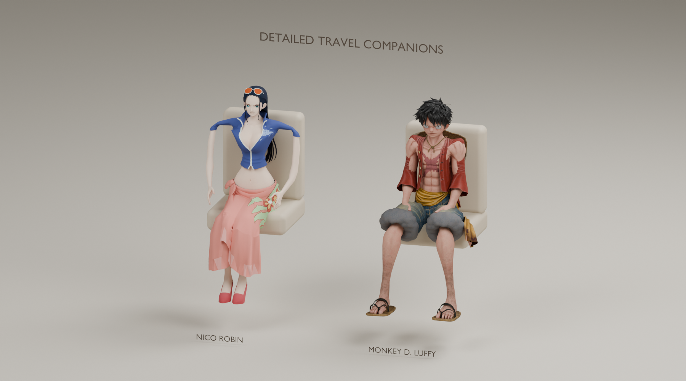
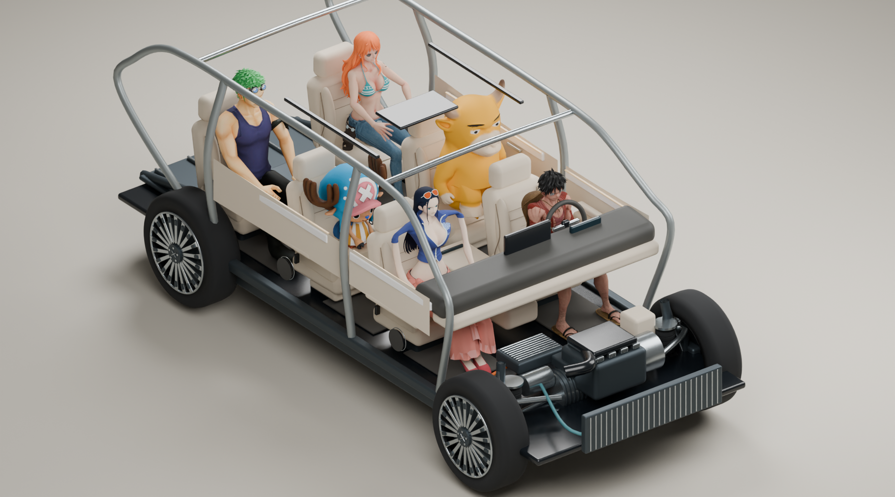

# 六人同行 · 换模与座舱净空

2026-10-08 · Role: A1 · Task: A1-FULL-021 · Identity-Source: user-declared · Executor: Codex

当前角色为 **牛来、妮可·罗宾、路飞、乔巴、娜美、索隆**。绫华从运行名单、头像和预设移除；旧本机资源已移出 public，历史 v2 文档只作存档。主驾、副驾及所有实际后排座位继续独立选择，允许重复角色。

路飞替换为另一套现成带 UV 贴图的三维网格，采用与乔巴、娜美、索隆相同的本机 GLB / 纹理材质加载流程。罗宾采用现成 OBJ，保留长黑发、墨镜、蓝色上衣和粉色花裙。为两人建立坐姿重定向骨架，导出驾驶/乘坐两种静态姿态；修复罗宾原 OBJ 裙摆错误 UV，保留膝前裙摆轮廓以避免腿部穿出。娜美、索隆的手掌按真实蒙皮顶点方向调整，避免 COLLADA 骨骼显示轴与手指方向不一致。





这些图片是 **Blender 离线审阅图**，不是网页截图。展台图中的椅子是审阅道具；装车图使用生产车模和运行时相同的拟合结果、腿部调整及接触修正。更多视图：[驾驶姿态](renders/new-drivers.png)、[GX 侧视](renders/gx-side-fit.png)、[M03 整舱](renders/m03-cabin-fit.png)、[M03 侧视](renders/m03-side-fit.png)。

## 这次修复了什么

- 原来的最低脚部允许高度为 0.22 m，低于实际内饰地板。现在读取模型实际地板（约 0.42～0.45 m），按脚部余量调整小腿；保留骨盆、躯干和头部比例。
- 合批前保存座垫、椅背、扶手、仪表台等独立实心包络，避免把断开的整批内饰当成一个实心盒子；方向盘使用环体约束，保留中间空洞。
- 按实际风挡/方向盘位置修正前排座椅距离；第二排腿托采用收起的行车状态，给小腿留出空间。
- 先在实际网格上搜索坐姿，再用全部顶点验证。每级比例优先尝试较浅的手指/衣物接触修正，再考虑整体缩小；单点总位移上限 35 mm，深层穿入仍报告失败，不删除网格来遮掩问题。M03 罗宾主驾从约 0.49 恢复到 0.69 比例，47 个接触顶点的最大修正约 20.2 mm。
- 每座实例独立拥有材质和变形几何；换人、清空、切车、关闭时释放，加载乱序不能恢复已经移除的人物。拟合只在换人/切车时执行，不进入逐帧声场循环。
- `草帽同行`：路飞主驾、娜美副驾，后排依次乔巴、索隆、罗宾；`伙伴三人`：牛来、罗宾、路飞。

## 验证边界

[最终检查日志](../../evidence/A1/A1-FULL-021/passengers-v4/check.log)：`pnpm check` 类型检查、A/B 边界、**332/332 测试**和生产构建通过。既有大块构建提示仍在；未新增运行时依赖。测试包括六角色全座位基础模型、真实地板与靠背约束、空心方向盘、全顶点复核、实例几何隔离/释放、局部接触限幅及优先保留人物比例。

[clearance-audit.json](clearance-audit.json) 记录五款车、28 个实际座位、6 位精细角色，共 **168 个组合**。检查模型全部顶点对地板、车顶和局部内饰约束的净空。基础模型另有全车型全座位自动测试。旧 `passengerFit` 只供 v2/v3 历史脚本，已从当前验收测试移除；运行时使用 `fitPassengerGeometry`。

[精细网格审计原始输出](../../evidence/A1/A1-FULL-021/passengers-v4/audit.log)：168/168 通过，最终最大局部修正约 28.4 mm（限值 35 mm）。前排座椅调整后，L03/M03 的旧射线测试恰好落在真实车顶横梁上；改用实际座垫前部作为可见落点，保留准确选中座位、剖切遮挡和拆装归位断言。修正后的完整回归已通过。

这是静态坐姿与内饰包络约束，**不是完整逐三角物理碰撞、布料模拟或实时人体 IK**。驾驶手势仍为预制姿态，未模拟握盘动作。人物按座舱尺寸适配，低顶车型有比例调整；人物不改变声学配置和计算结果。

浏览器打开本机 5190 的操作此前被自动审批以 URL 协议策略拒绝，本次未绕过。因此正式页面点击、720p/手机布局及网页帧率仍待人工验收。上述离线结果不能代替这些检查。

## 本机资源与团队接续

新资源来源、固定版本与摘要见 [inputs.json](inputs.json)，当前十二个 GLB 摘要见 [installed-assets.json](installed-assets.json)。路飞来源是 [alexzamurca/webgl3DModels](https://github.com/alexzamurca/webgl3DModels/tree/4ae7269450dbd932dedf71ce8d0448bbdb160b79/models/luffy)，其署名指向 [原模型页面](https://sketchfab.com/3d-models/monkey-d-luffy-damage-one-piece-36a78e0a19d84b3bbf8ffa772385fe97)；罗宾来源为 [CadNav #50655](https://www.cadnav.com/3d-models/model-50655.html)。这是实际取得的素材；此前探查的 Bounty Rush 路飞 / Odyssey 罗宾受资源站验证阻挡，未作为已下载素材冒报。

原包、贴图和转换 GLB 仍仅存本机，不上传 GitHub。未确认路飞素材独立再分发许可；罗宾页面与包内授权文字有差异且均不允许独立再分发，保留为本机审阅资产。代码、处理脚本、审阅图和检查数据可在本 PR 接续。新克隆没有本机缓存时会明确显示“基础模型”。包含此缓存的 dist 不作为公开部署包。

已有 v2 牛来及 v3 乔巴/娜美/索隆本机原包的开发机，在仓库根执行：

```powershell
# 确保本机缓存不进入提交（当前工作区已配置）。
Add-Content (git rev-parse --git-path info/exclude) 'public/passengers-local/'
python docs/design/passengers-v4/fetch-inputs.py --fetch
$blender = 'output/tools/blender-4.5.9-windows-x64/blender.exe'
& $blender -b --python-exit-code 1 --python docs/design/passengers-v4/inspect-source.py -- robin
& $blender -b --python-exit-code 1 --python docs/design/passengers-v4/inspect-source.py -- luffy
& $blender -b --python-exit-code 1 --python docs/design/passengers-v4/pose-assets.py
& $blender -b --python-exit-code 1 --python docs/design/passengers-v4/refine-existing-driver.py
pnpm exec tsx docs/design/passengers-v4/audit-clearance.mts --export
& $blender -b --python-exit-code 1 --python docs/design/passengers-v4/render-review.py
pnpm check
```

首次准备牛来、乔巴、娜美、索隆原包时按 v2/v3 来源摘要准备，但以 **v4** 作为最后处理和验收步骤；不要再把绫华或旧路飞复制回当前 public。网络验证或摘要不同会停止，不使用未验证文件。界面入口仍为车型旁的「同行伙伴」。
