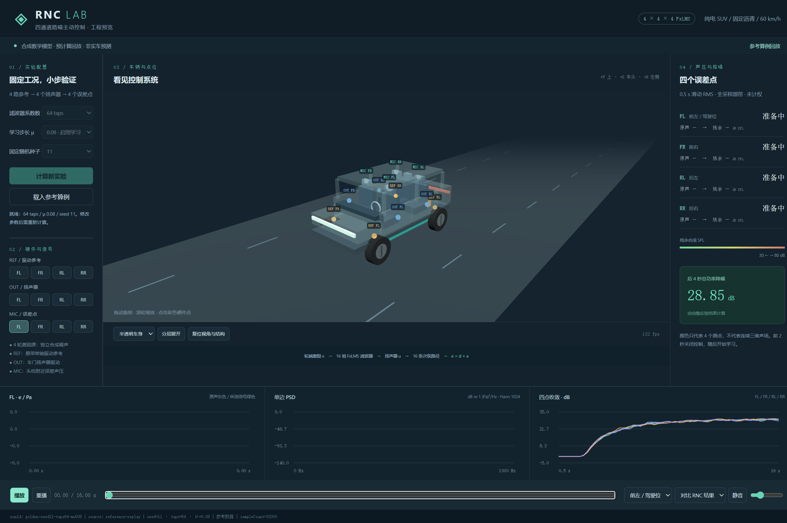

# A1-001 播放生命周期验证

日期：2026-09-23；执行：Codex-A1-lzhdai；[交付 PR #2](https://github.com/KnowCooker/RNC_3D_SIMULATION/pull/2)。基线源码来自 main 411fbed；协作规则依赖 PR #1。实现版本由本报告所在提交及 PR 最新 HEAD 定位。

## 复现与修复

基线浏览器操作：播放 → 进度 End → 显示“播放” → 进度 Home → 200ms 后按钮却为“暂停”，时间为00.22s。播放器保留running状态，导致结束后跳转自动播放。

首次编写的7项生命周期测试在原实现上6项失败、1项通过，覆盖首缓冲准备跳过开始位置、重复异步启动、加载新实验后旧启动继续、自然结束/跳转结束后的隐式重播、冷缓冲切换提前停止旧声音。额外补充过期请求、新旧音源ended事件和跨片尾切换后，最终10项生命周期测试通过。

改动：单一待启动请求与代次校验；暂停/加载取消旧启动；结束清理活动源，跳转按真正播放状态决定是否继续；首缓冲准备完毕才启动时钟；座位/模式冷切换准备好新缓冲后，在同一音频时间开始约30ms交叉淡化。界面在等待音频启动时显示“取消启动”。Pa→PCM固定增益、重采样与数值算法未改变。

## 自动验证

- `pnpm exec tsx --test tests/a1-player-lifecycle.test.ts`：10/10通过。使用可控Web Audio边界，包含全部四座位d/e路由与共同增益检查，不依赖真实声卡。
- `pnpm check`：类型、A/B边界、17/17测试、生产构建全部通过。既有主脚本大小提示仍在（约521kB），未作为性能验收。
- `git diff --check`：通过。

## 浏览器操作证据

Windows 11 10.0.26200、i7-12800HX、系统列出的实体GPU为RTX 4070 Laptop；另有虚拟显示适配器。本记录不推断浏览器实际使用的GPU。Node 24.13.1、pnpm 11.19.0、Playwright CLI 0.1.21、Chrome 153。

`pnpm dev:a --port 5173`，默认seed11/taps64/μ0.08参考回放；结果见 [browser-results.json](browser-results.json)。28项浏览器断言通过：

- 暂停在0.53s后等待仍保持该位置；继续播放不回退。
- 四座位逐一切换d/e，时间连续、选中信号标题正确。
- 静音期间修改音量，取消静音保留选择。
- 跳到结束后回到开头仍暂停；播放中、暂停中和自然结束后重播均有效。
- 实际等待完整16秒自然结束，再跳转不会自动播放。
- 延迟原生AudioContext.resume返回以验证“取消启动”和加载参考算例取消旧请求；其余操作使用正常浏览器音频。
- 没有未捕获页面异常。此前观察到已有favicon.ico的404，不把它描述成零网络错误。

浏览器检查脚本为 [browser-check.js](browser-check.js)，可在页面打开并取得snapshot后通过CLI复现：

```powershell
npx --yes --package @playwright/cli@0.1.21 playwright-cli -s=rnc-a1 open http://127.0.0.1:5173/ --headed
npx --yes --package @playwright/cli@0.1.21 playwright-cli -s=rnc-a1 snapshot
npx --yes --package @playwright/cli@0.1.21 playwright-cli -s=rnc-a1 run-code --filename docs/evidence/A1/A1-001/browser-check.js
```

早期浏览器检查采用固定200ms等待绘制，在窗口受节流时读到旧文本；最终脚本先等待目标显示状态，再检查保持状态。另一次截图前会话处于about:blank，重新导航并复现后才保存下面的有效截图。



## 明确保留的验收

未验证耳机/扬声器实物听感、爆音、实际声卡延迟及≤100ms音画偏差；未执行20分钟稳定性、目标核显或第二台Windows离线验收。代码级音频增益和浏览器按钮状态不代替上述设备证据。没有修改或验收A2车辆功能，也未修改B组算法或原始基准。
