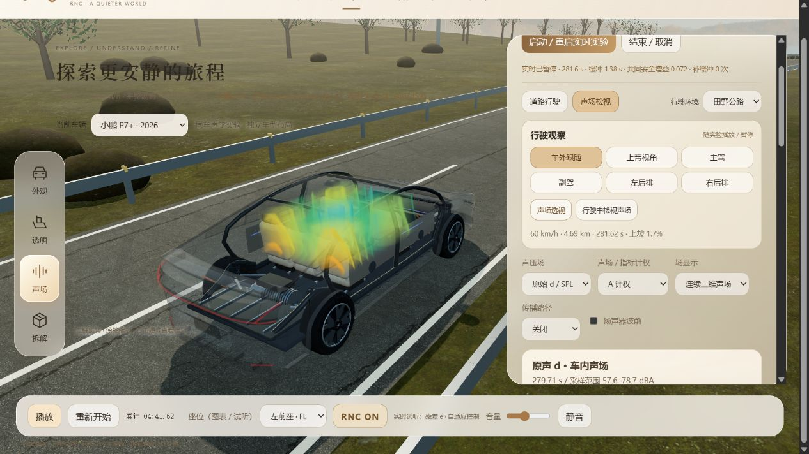
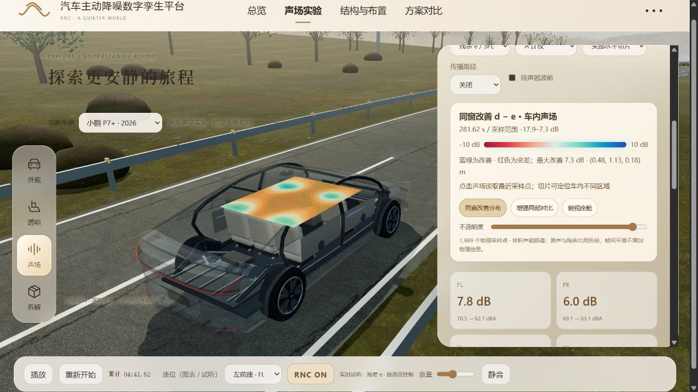
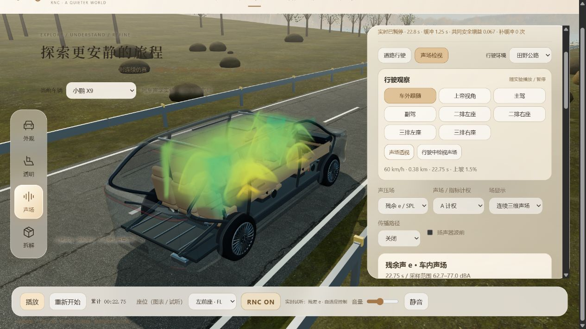

# A1-FULL-020 三维声场连续过渡

2026-10-04；Role: A1；Identity-Source: user-declared；Executor: Codex 代 A1。
基线 PR #57 `5be0802beec22be171e36c5b0d754b3799e09e21`；独立修复 [PR #58](https://github.com/KnowCooker/RNC_3D_SIMULATION/pull/58)，base `a/a2-driving-experience`。main `b968d92` 尚不包含本补丁。

## 改动与物理边界

- 旧体场最多350ms过渡，而完整场帧约1秒才到达，后半段长时间不动；三轴切片直接换纹理；A1的d/e选择先清空已有成对数据。
- 过渡随相邻物理帧时间间隔变化（80ms—2s），GPU平滑插值声能；新帧中途到达时从可见声能接续。体场与切片共享进度，切片前后纹理各自独立存储。
- 原声/残余/改善按各自色标交叉淡化颜色（280ms），不将SPL与改善量混成一个物理读数。使用渲染时钟进行显示过渡，暂停时可切换；物理播放仍只有原来的实验时钟。
- 同采样点下d/e和切片切换直接使用已有完整场；关闭、重启、车型/点位/计权变化仍隔离旧数据。暂停将时间插值落到最近实际场帧；没有预测未来声场。
- B计算、shared/integration、资产、冻结基准不变。没有提升物理采样频率，读数保持真实最新完整帧；画面会在过渡期间滞后于最新帧读数。切片平面切换仍为几何切换，本轮不做形变动画。

## 验证结果

| 检查 | 结果 | 证据 |
|---|---|---|
| 新增4个针对性回归 | 原版失败，修复后通过 | `a1-full-020-red.log`、`tests/a1-field-transition.test.ts` |
| 新回归+原A2密集体场测试 | 9/9通过 | 已包含于完整/A组日志 |
| A1/A2与player/viewer测试 | 165/165通过 | `a1-full-020-a-tests.log` |
| pnpm check（类型、边界、全仓） | 类型/边界通过；288/291 | `a1-full-020-check-final.log` |
| 独立pnpm build | 通过；保留既有>500kB包体提醒 | `a1-full-020-build.log` |
| 实际IAB页面，真实Worker | 下述交互通过，控制台0警告/错误 | `browser-audit.json`及截图 |

完整check的3个失败仍是父分支B2导出测试：model/source/recording身份、未知layout编码/重算、未知model/layout只读导入。没有降低断言或把check标为通过。稀疏检出首轮还缺B oracle/B2 reference-audit（`a1-full-020-baseline-complete.log`留下当时4项失败）；恢复仓库原证据后B引擎23/23（`a1-full-020-baseline-engine.log`），最终仅上述3项。首轮实现另发现Texture.clone共享Source，切片两帧别名；改为独立DataTexture后回归通过。

### 连续性复现

`cadence-probe.ts`是合成数据诊断夹具，**不是产品物理结果**。从根目录运行：

```powershell
pnpm exec tsx docs/evidence/A1/A1-FULL-020/cadence-probe.ts
pnpm exec tsx --test tests/a1-field-transition.test.ts tests/a2-dense-volume.test.ts
```

1秒到帧的混合系数：原版在0.35、0.5、0.75、0.99秒均为1；修复后分别为0.28175、0.5、0.84375、0.999702。前后输出保存在`a1-full-020-baseline-transition.json`与`a1-full-020-after-transition.json`。回归还验证中途到帧接续、原数组不变、同窗模式切换不重传纹理、暂停及新身份隔离。

### 真实页面复验

Windows本机Codex IAB，`pnpm dev --port 5190 --strictPort`，独立隐藏QA页，不改变用户正在看的页。使用页面可见控件与DOM读取，未注入应用状态。

1. P7+ → 声场实验 → 启动实时实验 → 行驶中检视声场；1989采样点体场可见，无Shader错误。
2. 暂停后切原声/残余，切三个轴向切片、同窗改善；场保持可见。P7+截图窗口279.71s/281.62s不同，是暂停前最后一次在途查询完成，并非伪造同窗对比；截图只是渲染证据，不证明动画帧率。
3. A→Z先隐藏A场并显示等待，随后同281.62s得到Z场（71.5—100.4dB SPL）；再回A，恢复播放。
4. RNC关闭后322.06s的1989点改善均为0；开启按钮可用。随后暂停并切X9，旧场与旧图表清除，实验时钟重置，显示待计算配置。
5. X9重新启动可得到其独立布局声场。暂停至22.75s稳定窗口，残余体场→原声体场→水平切片，DOM的data-time均为22.75，quantity/rendering正确改变；详见`browser-audit.json`的sameWindow=true。恢复残余体场并截图。





未做第二机、核显、GPU性能量化或长稳验收；本页不承诺60fps。不同GPU的手动浮点过滤分支有CPU状态回归，未单独强制该分支做真实GPU编译验收。父PR/全仓B2阻塞解除后再集成main。
