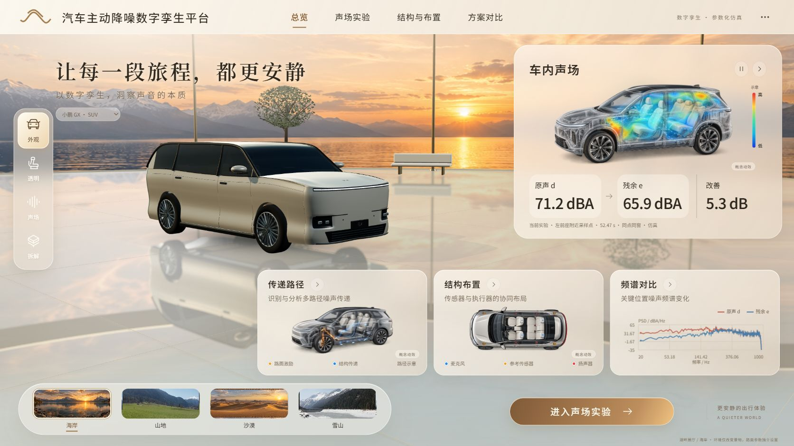

# 总览高清动效与字体图标（A1-FULL-021 追加）
2026-10-04 · Role: A1 · Identity-Source: user-declared · Executor: Codex 代 A1。

继续同一分支 `a/a1-full-021-champagne-alignment` / [草稿 PR #59](https://github.com/KnowCooker/RNC_3D_SIMULATION/pull/59)。认领追加 cc786f1；基线85394f7。依赖#58/#57，未合并main。

## 最终行为
- 总览声场、传递路径、结构布置三卡采用1774×887透明PNG高精度概念渲染，加连续CSS/SVG动效：体场光晕/波纹、沿路径移动的光点、硬件点位呼吸。像素源未做程序修图，使用内置imagegen；[原图、精确提示词、SHA及许可](../../../../../src/team-a/lab/assets/overview/README.md)。
- 三张图标明“概念动效”，色标仅相对强弱；不是当前车型的计算帧。原声/残余/改善与频谱仍来自当前实验，不填母版75.8/61.9/13.9。三个展示canvas已从总览移除，不再重复WebGL离屏绘制。
- 声场图/箭头/主CTA进入当前车型声场检视；路径卡进入同车3D初级/次级/全部路径，控制原理图保留辅助入口；结构卡进入同车透明模型与安装点。切换GX→X9仍绑定对应资产与布局，保留路径检视，清除旧实验结果。
- 本地OFL中文变体字体：RNC Sans界面、RNC Serif主标题（约236KB + 18KB），统一线性SVG图标/箭头/关闭/暂停/品牌留白，保留最终香槟母版布局。图表使用统一字体，缩放时按实际画布尺寸重绘。
- 手动暂停/恢复；离开总览、滚出视口、页面隐藏时暂停；系统减少动态效果时静态展示并禁用播放按钮。组件销毁断开观察器/监听；未改实验时钟、B算法或物理数据。路径右侧控件不遮住车辆；结构仍保留拆装。

## 已执行验证
| 项目 | 结果 / 证据 |
| --- | --- |
| A1/A2/player | 166/166，a-tests.log；最终全仓再次覆盖相同A用例 |
| 类型、边界 | pnpm check通过这两阶段，check-final.log |
| 全仓测试 | 289/292；仍3项既有B2失败，见下 |
| 独立生产构建 | build-final.log通过，字体/PNG均打入dist；保留既有大包提示 |
| 桌面1672×941、1440×900 | 构图/字体/图标/三图/真实频谱目视通过 |
| 手机390×844 | scrollWidth375≤390，三卡纵排、入口可点击；屏外两卡暂停 |
| 暂停与运行 | 运行时strokeDashoffset/呼吸transform实际变化；两次暂停样式完全相同；进入子页三卡paused=true |
| 真实实验 | GX实时Worker返回1989点残余场；暂停后回总览52.47s同点读数71.2/65.9dBA、5.3dB（仅该次运行） |
| 子页 | 次级路径、结构卡、声场卡、控制机理开闭、GX→X9路径跟随均通过 |
| 控制台 | 本次IAB记录0警告/错误，browser-audit.json |
| 减少动态效果/后台页 | 代码接线及CSS覆盖已检查；未改变用户系统设置，不声称实际OS偏好切换或跨设备测试完成 |

三项B2失败：model/source/recording identities；unknown layouts encode/recompute；unknown model/layout read-only import。保持原断言/fixture。完整check非绿色，不把独立build通过等同于全部通过。未修改B/shared/integration/viewer。

## 实图

[1440](overview-1440.png) · [手机最终](overview-390-final.png) · [真实声场](real-field.png) · [真实路径](real-paths.png) · [真实布局](real-layout.png)

PNG是运行页面截图，只记录动效的某一帧；查看连续效果请在本候选工作区运行 `pnpm dev --port 5190 --strictPort`，访问 http://127.0.0.1:5190/。首屏三卡无需计算即可播放；数值必须运行实验才出现。右上暂停控制只管理展示动效，不暂停实验。

## 保留边界与下一步
主车及子页仍用现有照片参考重建的GX/X9等模型，不是原厂CAD或实车标定；本轮精细化的是总览展示素材。实际主车曲面/内饰升级仍由A2在同一车型资产上推进。图像增加约6.05MB原始资源，无外部字体CDN/新增NPM依赖；未量测核显fps、移动真机、长稳与第二机断网。下一步按#57→#58→#59依赖审阅；B2兼容失败单独交接。
