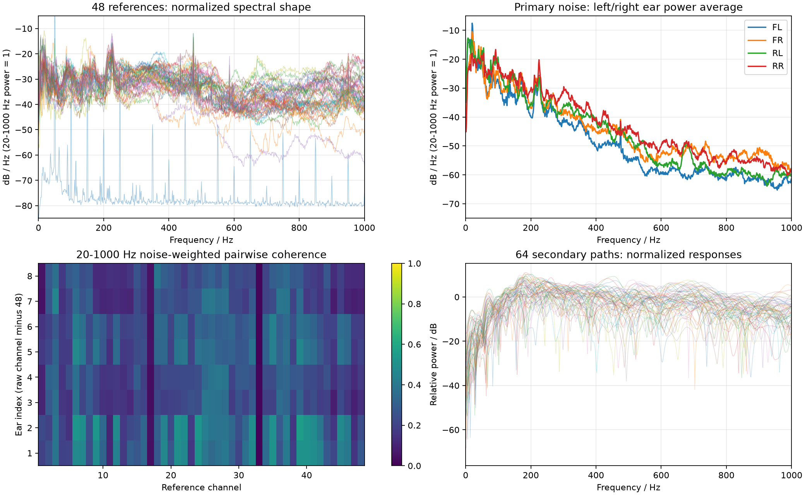
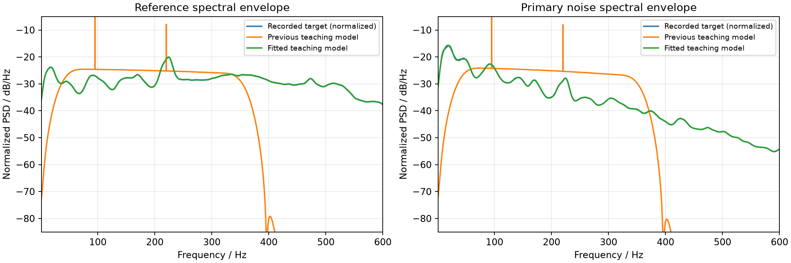

# B1-DATA-001：实录通道提取与教学谱形更新

- 日期：2026-09-25；Role: B1；Identity-Source: local-config；执行者：Codex。
- 版本：3c43a99加B1-UI-001/002和本批未提交改动，分支b/b1-coordination；仅本地，未创建分支、提交、上传或PR。
- 授权：用户指定本地三个文件，要求仅从MATLAB提取通道/采样率等信息，再根据实录频谱优化本工程。用户补充：纯电车、40 km/h、粗糙路；所有采集通道未经校准，单位V；次级路径为8头枕扬声器，可以不用并自行构造合适路径。
- 主责说明：本任务涉及原B2的数据与说明工作，按B1用户本次请求执行，不宣称完成旧demo-v2的B2-001。A1页面仅增加来源/单位说明；package.json仅纳入新增B组测试。这些最小跨组/共管改动随明确任务授权执行，FxLMS算法、分析口径、A2 viewer和冻结基准不改。

## 1. 数据识别与原样提取

读取 `C:\baidunetdiskdownload\pri.dat`、`secpath.dat`、`filter_cal_couple.m`；MATLAB按GBK读取说明。**没有执行MATLAB，也没有复制它的EHRF、高通/等时延、wrong_idx通道置零、维纳/GPU解算、W符号/导出、ANCON仿真、sensitivity=35或50–600Hz评价流程。** 频谱分析/拟合脚本是本工程独立编写的离线工具。

采样率来自fs=4000；pri采用每采样56路交错排列。正文8,960,000个数，可严格还原为160,000采样×56路，即40秒。secpath正文16,384个系数，与256点×64路径一致；按MATLAB DAT布局说明还原为[扬声器8, 误差8, tap256]。文件头是设备自定义信息，保留但不猜其标志位语义。

| 数据 | 原始物理通道（从1开始） | 保存内容 |
| --- | --- | --- |
| 参考信号 | 1–48 | 全部48路原始V；具体安装位置/方向尚未知 |
| 主驾 / FL | 49、50 | 左、右耳原始V |
| 副驾 / FR | 53、54 | 左、右耳原始V |
| 主驾后排 / RL | 51、52 | 左、右耳原始V |
| 副驾后排 / RR | 55、56 | 左、右耳原始V |

完整提取数据放在仓库外相邻目录 `../实测数据分析/recordings-original.npz`（约67.4MB），附README；不混入应用资源或Git。原始时序未去均值/滤波/归一化/重采样/置零，Float64保存文本读取值。独立的[二次读取验证](verify_extraction.py)使用np.loadtxt重读，逐元素相等，三个原文件SHA256未变，见[extraction-check.json](extraction-check.json)。具体SHA在该文件和[audit.json](audit.json)中。

双耳仅在分析时平均功率谱，不直接平均波形，避免反相抵消；仿真仍每座位一个教学误差点。实录8耳的座位电压差异没有被当成已标定的SPL差异。

## 2. 频谱发现与通道筛选原则

全40秒使用1秒周期Hann窗、50%重叠、单边Welch PSD，1Hz频点；只在估计窗口去均值，原始数据不改。所有参考均非恒定，**保留全部48路**；未采用MATLAB的1/17/33置零规则。第4、33路电压RMS较低，但位置/灵敏度未知，不能仅据幅值判为无效。

- 耳旁噪声主要在100Hz以下，前排常见20–50Hz峰簇，后排还可见50–100Hz峰簇；不同耳点强弱明显不同。
- 参考频谱更宽，中位归一化谱在200–350Hz能量较多，并保留350Hz以上分量。不能把参考和噪声都简化为同一个平坦带通。
- 仅作描述的20–1000Hz噪声加权“单参考—单耳”幅值平方相干性均值，排名前8路为6、39、37、26、3、25、28、35；最高均值约0.413。见audit中的48路完整排名。此结果**不是因果可控性或多参考最优选择证明**，没有据此将未知安装点映射成四个轮端，也未删除其他路。
- 原始频谱完整保留0–2000Hz；教学运行采样率2000Hz，只拟合其0–1000Hz可表示范围，900–1000Hz平滑收尾。没有按MATLAB删除50Hz以下能量。



## 3. 实际接入的软件数据

生成配置ID：`bev-40-rough-voltage-spectrum-v1`，见[src/team-b/lab/recorded-profile.ts](../../../../src/team-b/lab/recorded-profile.ts)。只保存派生的归一化谱形FIR、源文件哈希和元信息，应用不依赖原始DAT、Python、SciPy或MATLAB。

1. 源FIR：对48路参考各自在1–1000Hz按谱功率归一化，再取频点中位值并作4Hz对数谱平滑；结合当前默认参考路径频响，生成255系数最小相位FIR。四路不同种子的合成激励经该FIR产生q，取代原35–360Hz带通及95/220Hz固定纯音。
2. 初级路径修正：对8耳电压PSD取平均、归一化，并结合q及原几何H设计129系数共同因果FIR。该修正卷积到本工程所有初级路径；保持车型/距离/反射和任意点空间计算的一致性。**这只是谱包络拟合，不是通过实录x/d辨识得到的真实H。**
3. 次级S：保留原4车门扬声器合成路径及16条交叉影响。8头枕×8耳实测路径不符合此拓扑，未强行抽成4×4，也未改变原FxLMS更新式和S_hat=S假设。
4. 源幅值以40km/h为基准，粗糙度1表示该粗糙路相对基准；速度/粗糙度/温度幅值规律仍为教学外推。胎压/温度通过FIR时间轴伸缩改变谱形，不新增纯音；240kPa/20°C为教学默认，用户未提供录音时胎压温度，不能视为实测标定值。其他车型也仍是教学外推。
5. 批量与实时共用源FIR实现；源延时环由256增至512，场前史由64增至192采样，避免新路径较长时跨块丢失前史。现有4096样本试听快照与32000样本场快照足够。
6. 页面标明“实录为未校准V；Pa/SPL为教学尺度”。不依据sensitivity=35或归一化比例伪造实测声压；没有把真实电压直接塞进Pa信号。

## 4. 谱形对照

以下是拟合目标（4Hz平滑后）与真实TypeScript生成16秒数据（seed11、BEV、40km/h、默认240kPa/20°C；分析跳过合成启动首秒）的频带功率占比。每列相对1–1000Hz总功率，频带误差对这些占比计算10log10比值后取绝对值均值，不是SPL误差。

| 频带 Hz | 参考目标 % | 合成参考 % | 原声目标 % | 合成原声 % |
| --- | --- | --- | --- | --- |
| 1–20 | 4.98 | 5.12 | 28.04 | 30.19 |
| 20–50 | 4.72 | 4.70 | 34.78 | 33.66 |
| 50–100 | 5.68 | 5.77 | 18.66 | 18.34 |
| 100–200 | 12.92 | 13.08 | 12.01 | 11.57 |
| 200–350 | 37.70 | 37.68 | 5.67 | 5.45 |
| 350–600 | 25.29 | 25.01 | 0.75 | 0.70 |
| 600–1000 | 8.70 | 8.63 | 0.09 | 0.09 |

真实生成信号的7频带平均偏差：参考0.048dB，原声0.200dB，见[actual-spectrum-check.json](actual-spectrum-check.json)。解析谱包络和旧模型对照见[fit-comparison.json](fit-comparison.json)；旧模型均值误差受缺失的高频小功率频带显著影响，不拿这个数字代替听感或实车效果验收。



拟合并未以降噪量为目标。基准实验计算约276ms，末4秒教学改善约18.69dB，见[simulation-check.json](simulation-check.json)；这依赖理想化合成源/路径相干关系，**不能解释为该录音或该实车可以降噪18.69dB**。未拟合四座位各自的完整谱形、实录相位关系、因果预见量或实车次级路径。

## 5. 验证与已知边界

- pnpm check：77/77测试、TypeScript、目录边界、生产构建通过；已有约593kB viewer构建提示仍存在。test:b已包含新增谱形验证。
- 新增谱形测试覆盖3个随机种子、原声低频与参考高频占比；胎压/温度两端的批量/流式逐样本相等、源能量归一、空间路径前史容量。
- 既有640,000样本Python冻结基准和五算例对照未改变；e=d+a、真实交叉路径、全通道批量/实时等同、滚动空间场及输入失败保护均通过。
- 首轮B测试发现新低频谱使旧μ=0.5极端组合发散，未调整数值容差、限幅u或修改梯度公式。默认μ=0.08的高能量及参考重合工况仍有限；对应回归改为明确验证这些运行点和μ=0.5显式报错，保留实际有符号降噪量核对。该边界已同步模型说明，不能宣称所有合法参数组合都稳定。
- SciPy本机导入被应用控制阻止，分析改用NumPy FFT实现并完成；MATLAB从未执行。matplotlib只用于离线出图，不增加应用依赖。
- 本地5173浏览器：页面明确显示实录V/教学Pa区别；改为40km/h后计算完成395ms，回放定位8秒，RR三张图与残余空间场均正常。实时模式保持声场开启运行到33.68秒后暂停，补缓冲0次，曲线保留最近历史；自动化期间静音。实物听感、长期稳定性、不同工况实录与物理校准仍待专项验收。

## 6. 复现和交接

在工程根目录，用具有NumPy和matplotlib的Python及项目Node环境运行：

```text
python docs/evidence/B/B1-DATA-001/analyze_recordings.py --input C:\baidunetdiskdownload --extraction ..\实测数据分析
python docs/evidence/B/B1-DATA-001/verify_extraction.py C:\baidunetdiskdownload ..\实测数据分析
node --import tsx docs/evidence/B/B1-DATA-001/export-geometry.ts
python docs/evidence/B/B1-DATA-001/fit_profile.py
node --import tsx docs/evidence/B/B1-DATA-001/validate-profile.ts
python docs/evidence/B/B1-DATA-001/fit_profile.py
pnpm check
```

第二次fit使用实际生成数据核对频谱；系数生成与控制输出无关。audit/PSD/图/FIR派生文件可随本批代码与记录一起提交；原始录音提取仍留仓库外。下一位B成员可从本报告和模型说明继续；要做真实信号控制回放，必须另行确认参考安装/校准、8输出8误差接口及真实S的硬件对应，不能把本批谱形拟合冒称完成该目标。
