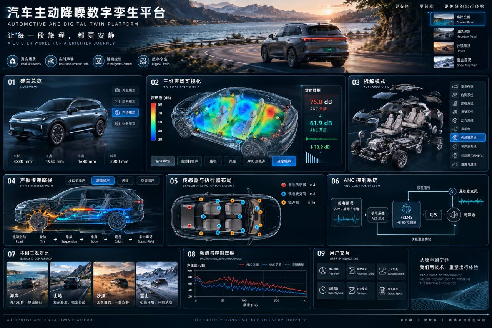
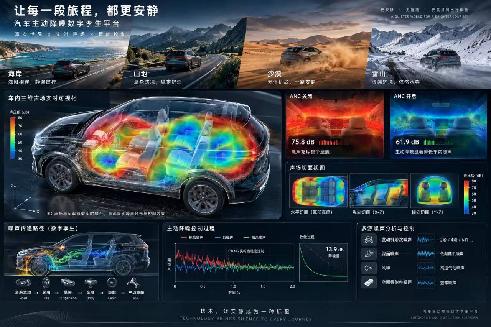

# 最终产品形态：道路 × 同车声场 × 降噪证据

2026-09-29 用户指定下列两张图作为**最终产品形态基准**。它们定义的是产品体验、信息层级和视觉完成度；图中的车型外形、风景、热力分布及 `75.8 / 61.9 / 13.9 dB` 是概念示意，不能直接作为当前应用的实车资产、计算结果或验收证据。图片由用户在本次任务提供，存档供两端 Codex 对照，不作为应用运行素材。

## 要让用户完成的事

从一辆车、一段道路出发，亲眼看到路面和车辆结构如何把噪声送进座舱；选择座位与声场位置，比较 ANC 关闭/开启前后**同一工况、同一时窗、同一计权**的差异；能追溯传感器、扬声器、传递路径和控制过程，最后形成可复核的方案判断。视觉冲击力服务于这一条证据链，不用概念图片代替计算。

## 页面结构和验收

| 区域 | 最终用户能做什么 | 当前基线（2026-09-29，main `da95b3c`） | 主责 / 完成门槛 |
| --- | --- | --- | --- |
| 道路入口 | 在海岸、山地、沙漠、雪山四种**实际三维场景**间切换；相机、车辆、路面材质、轮噪参数同步 | 有道路/车间和 3 种三维路面材质预设；四种环境尚无同版实现 | A2 场景/材质与统一车辆；A1 工况入口和状态；B 给出各路况可复核声源参数。四个场景不能只换背景图 |
| 整车总览 | 360° 看车、车身透明、剖切、座舱与动力架构、部件选择 | 原创教学车具备交互；ICE 有写实 GLB 外观及 #30 草稿的部分原资产拆解，但同车内部物理锚点不完整 | A2 对四类车分别证明道路、车间、教学共用同一资产/坐标与可辨结构；许可、性能、安装件清单可审计 |
| 主舞台声场 | 在同一辆车的座舱内显示真正三维声压热力场、固定色标、探针与纵/横/水平剖面，能比较原声和残余声 | 教学车已有 280 点真实计算场、切片和采样改善证据；写实外观不投影教学场 | A2 同车场几何和交互；B 同布局声学计算；A1 同帧切换/对比。所有色彩可追溯到有效 `FieldFrame`，无场帧显示不可用 |
| 拆解与传递路径 | 同车逐件拆解/回装，看到轮端→悬架→车身→座舱与四门扬声器的路径及硬件位置 | 教学车路径、硬件与动画可看；写实 ICE 仅部分美术资产组，非完整机械/声学布局 | A2 分件/安装锚点，B 对应 H/S 路径；动画示意与计算值明确区分 |
| ANC 对照 | 一键查看同座位、同时间窗的 OFF/ON 声场、dB、频谱和公平试听；能解释改善与变差 | 真实 RNC 开关、四座指标/频谱/试听和空间采样改善已有，但未形成参考图式的同屏场对照 | A1 比较页面/操作，B 数值与同窗身份，A2 场视图；未标定 dB 必须明确教学尺度 |
| 证据与控制 | 查看 FxLMS/MIMO 信号、传感器和执行器布局、时域/频域/收敛、A/B 工程评审及来源限制 | 已有主要数据和交互，但结构层级与视觉叙事尚未达到两图 | A1 把数据整理为总览→场景→解释→决策的顺序；避免重复、失效结果和伪实时标签 |

## 不可妥协的体验约束

1. **一辆车贯穿始终**：道路、车间、拆解、剖面、热力场及硬件标记都属于当前车型的同一几何和物理布局。只在写实外壳上叠教学车结果不能签收。
2. **同一实验才可比较**：车型、车速、路况、布局、座位、时窗、计权、RNC 状态需明确；任一不一致或帧过期，清空比较而不是保留旧数值。
3. **视觉说明真实状态**：热力图颜色有单位与固定色标，声场采样点/有效窗可查询；图片中的宣传值绝不硬编码。未完成四场景或物理布局时，界面明确显示当前已实现能力。
4. **可交互且可分发**：桌面和窄屏可完成主线；目标核显和第二台 Windows 真断网、实际音画性能及来源/许可按[A组交付标准](../coordination/A_FINAL_DELIVERY.md)单独验收。

## 工作顺序与边界

- **A1 当前批次 A1-FULL-018**：保存上述基准，重排正式实验台的信息架构，使道路入口、三维主舞台、场/路径/拆解、ANC 对照和数据证据形成明确顺序。只接现有真实配置与计算状态，做浏览器桌面/窄屏证据。
- **A2 当前独立任务 #30 及后续**：完成四车型同资产结构、可审计的轮端/麦克风/扬声器/参考锚点和四种三维道路环境；提供同车剖面与场渲染接口。A1 不编辑 `src/team-a/viewer/**`。
- **B 与集成**：以 A2 已核实布局计算源/H/S、同点同窗场、ANC 对照；对未知布局拒绝，绝不把 `teaching-fixed-v1` 结果标成写实车结果。共管契约由指定协调者处理。
- **最终组合**：四车型 × 四环境的关键流程、真实同帧场、试听和证据在同一源码/构建版本复核，之后完成目标设备与离线验收。

本页是产品终点，不改变[完整目标](10_FULL_GOAL.md)的四动力车型、参数化路噪、动态传感器/扬声器、MIMO 算法和证据要求，也不把阶段 UI 完成当作最终产品完成。
