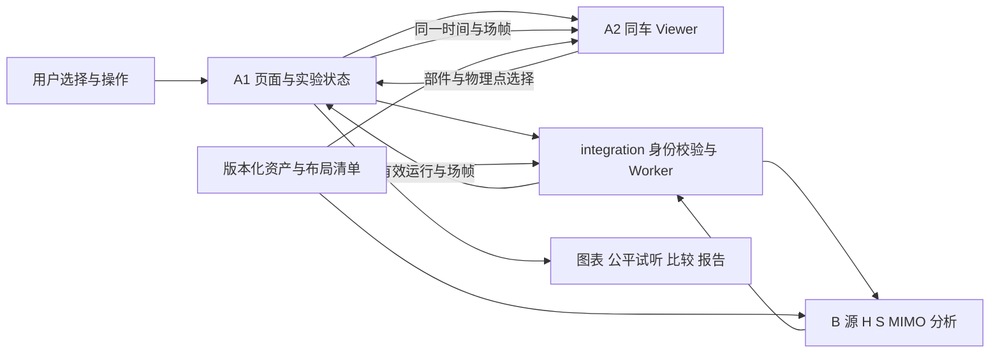

# 云境香槟最终展示形态实施方案

本方案面向 A1、A2、B1、B2 及各自的 Codex。目标是把用户批准的湖畔展厅界面变成可信、流畅、可交付的三维声学产品，同时复用已完成的代码和资产。**执行结论：固定视觉目标，保留现有计算与播放内核，先完成一个同车同数据的完整操作流程，再扩展四车型和四环境。** 单车型阶段是集成顺序，不降低最终范围。

日期：2026-09-30。编制角色 A1，任务 A1-FULL-019，身份来自本会话用户声明。事实审计基线为原仓库 main `fa805e2da2ec16ce7e17a087b202ec3380a48ba2`；当前设计发布见[最终展示入口](../design/FINAL_PRESENTATION.md)。本文件的待办是任务分配方案，不替其他角色认领，不启动后台代理。

## 1 从第一性原理确定产品价值

领域专家不缺少公式和曲线，真正耗时的是在复杂信息中确认：现在研究什么、现象发生在哪里、原因是什么、方案是否值得采用。产品应缩短从问题到可信判断的路径。

因此，核心操作固定为：

**选择车辆与工况 → 定位座位和空间问题 → 解释结构与传递路径 → 改动一个方案因素 → 同条件比较 → 留下可复核结论。**

评价优先级如下。

| 原始需求 | 产品必须做到 | 对应设计决策 |
| --- | --- | --- |
| 用户首先需要理解当前对象 | 车、工况、时间和数据来源始终明确 | 同车主舞台与紧凑状态；跨页保持上下文 |
| 人更容易理解空间关系 | 能把噪声位置对应到座舱和结构 | 透明车、热图、切片、探针、部件点选 |
| 判断必须能归因 | 把控制收益与工况变化区分开 | 同窗 d/e 比较、受控 A/B、差异清单 |
| 结论必须可追溯 | 数值、颜色、声音与报告属于同一实验 | 一个运行身份、一个时钟、同一布局和计算口径 |
| 展示应让注意力集中 | 重要结果清晰，复杂机制按需展开 | 总览主次与批准图一致；详细参数进入工作页或浮层 |
| 团队需要并行而非互相等待 | 几何、页面、计算可独立开发并组合 | 单一文件负责人、稳定接口、独立验证夹具 |

“惊艳”由三个可验证结果构成：第一眼识别高品质整车和空间；一次操作看清座舱变化；追问时能展开来源、限制、局部变差和比较条件。装饰动画不能替代这三个结果。

## 2 最终范围与批准层级

最终视觉依据是[用户批准首页](../design/champagne-final/screens/01-overview-approved.png)。保留其湖畔夕阳、展厅建筑、银色 SUV、暖白玻璃、香槟按钮、导航、左侧模式栏、右侧声场卡、下方三卡、四场景和主操作的位置关系。子页按同一风格展开，见[交互规格](../design/champagne-final/UI-INTERACTION-SPEC.md)。

最终功能仍覆盖 ICE、BEV、HEV、EREV 四类双排 SUV、同车外观/内部/拆装/声学布置、四种实际三维环境、真实教学声场、调参改制、连续仿真与回放、公平试听、比较和离线交付。

需要严格区分三种状态：

- **已确认设计**：首页视觉、信息层级与本套风格。
- **已存在功能**：本次审计的 main 源码和注明版本的证据。
- **最终通过**：在新页面、新资产、新布局和新计算组合的同一版本上完成全部验收。

图中的 75.8、61.9、13.9 dB、热力分布、传感器数量和示例曲线不是目标结果。正式页面用真实数据替换。原型只有图片和控件状态，不能进入运行页面作为伪三维展示。

## 3 当前仓库事实与真正缺口

下表是 2026-09-30 的读取结果，后续接班必须重新 fetch 和查询开放 PR，不能长期把本表当成实时状态。

| 事项 | 已有事实和证据 | 尚缺内容 |
| --- | --- | --- |
| A1 页面入口 | #46/#47 已合并；[lab/index.ts](../../src/team-a/lab/index.ts) 含道路入口、参数、场、拆装、图表、试听与证据 | 当前深色工作台需要按四页信息结构迁移；并非从零写实验系统 |
| 三维教学模型 | [vehicle-model.ts](../../src/team-a/viewer/vehicle-model.ts)、剖切/爆炸/标记/参考编辑已存在 | 教学几何与写实 GLB 不一致；外观模式不能直接套用旧物理点 |
| 写实资产 | [资产记录](../../src/team-a/viewer/assets/README.md)：Range Rover 5,726,332 字节、74,127 三角；Model Y 10,353,640 字节、287,080 三角；仓库保存历史许可核验与哈希 | 两者都不是批准图中主车的精确三维资产；HEV/EREV 缺独立成熟资产，真实机械结构和锚点仍需核实 |
| A2 同车检视 | [PR #30](https://github.com/KnowCooker/RNC_3D_SIMULATION/pull/30) 草稿，HEAD `d8e27178ca634c75e17448a2bb98fd1f1a7f85f7`；分支交接已有独立33项/组合67项浏览器记录 | 未合入 main；其组合基线较旧，有 GLB 偶发取消记录；需对当前 main 重验，不能直接称待补所有浏览器证据或直接视为完成 |
| 环境与路面 | [scene-stage.ts](../../src/team-a/viewer/scene-stage.ts) 有 road/workshop、smooth/coarse/gravel；A1 已连接 0.6/1.2/2.2 粗糙度 | 湖畔展厅和山地/沙漠/雪山完整环境未交付；环境名称不能等同物理路面 |
| 声场和分析 | [sampleField](../../src/team-b/lab/index.ts)、[field-slices.ts](../../src/team-a/viewer/field-slices.ts)、[field-evidence.ts](../../src/team-a/lab/field-evidence.ts) 有真实空间采样与改善/变差统计 | 需在写实车经核实的坐标中计算和绘制，并完成同窗双视图；不能把四座改善外推全车 |
| 布局身份 | [lab-contracts.ts](../../src/shared/lab-contracts.ts)、[lab-engine.ts](../../src/integration/lab-engine.ts) 和 Worker 拒绝非 teaching-fixed-v1 布局、核对场帧身份 | B 路径仍引用固定 SOURCE/MIC/SPEAKER_POSITIONS；纯函数入口与真实新布局支持需 B1 完成 |
| 数值基线 | [#48](https://github.com/KnowCooker/RNC_3D_SIMULATION/pull/48) 已合并；[B1-001](../evidence/B/B1-001/README.md) 五配置、100路、320万样本对照，151项全仓检查记录 | 只证明 demo-v2 该批数值；不证明 lab-v3 新布局、新素材或真实车型已经验证 |
| 比较与报告 | [case-compare.ts](../../src/team-a/lab/case-compare.ts)、[case-evidence.ts](../../src/team-a/lab/case-evidence.ts)、[case-review.ts](../../src/team-a/lab/case-review.ts) 已有轻量评审摘要 | B2-003 [设计提案](../evidence/B/B2-003/EXPORT_DESIGN.md) 已随 #44 合并，完整导出 API 未实现；不能用摘要代替全信号还原 |
| 发布与验证 | [离线打包](../../scripts/package-offline.mjs)、[包校验](../../scripts/verify-package.mjs) 已存在 | 新版必须重新构建与签收目标核显、音画、第二机真断网、四车型和长期运行 |

B.md 部分旧队列仍写“B1-001未完成”；以 #48 合并事实纠正依赖判断，由 B 组下一次接班回填自己的状态。本计划不改写 B 或 A2 的个人交接。

## 4 资源如何接入新页面

采用“更换展示层，复用已验证业务与计算”的迁移方式。不要复制一个新引擎，也不要把整张设计图作为生产背景。

| 最终区域 | 复用资源 | 接入方法与主责 |
| --- | --- | --- |
| 顶部导航和四页框架 | mountLab、现有状态与端口 | A1 将布局拆为页面视图，公共实验状态保留在上层；切页不重复创建 Worker 或播放器 |
| 首页车辆与左侧模式 | createLabViewer、OrbitControls、showroom-model、剖面/拆装能力 | A2 提供同一车辆实例的展示模式；A1 发送意图，不通过 DOM 查找触发 A2 私有按钮 |
| 首页右上声场卡 | FieldFrame 原声/残余/改善数组、固定色标 | A1 绑定同一有效运行快照；A2 用同车坐标出场图。未运行显示引导，不显示母版中的示例数值 |
| 三张摘要卡 | signal-flow、path-analysis、case-compare、plots | A1 复用当前选择与图表数据，点击进入对应页/抽屉；摘要只提取当前有效窗口 |
| 四环境入口 | 当前三种路面与 roadPreset 回调 | A2 新增真实环境；A1 管理环境选择和工况提案；B1 定义可用声源参数。换风景不偷偷更改速度/温度 |
| 声场实验大舞台 | field-slices、探针、物理采样与 Worker field 调用 | 先复用280点和三向切片，提升材质/遮挡/清晰度；高密度渲染按性能分级，场值保持同源 |
| 参数与统一回放 | LabPorts、Player、LivePlayer、plot-settings | A1 复用启动/取消/失效/时间，保留实时与预计算的不同语义 |
| 结构与布置 | 原始分件、#30检视、参考 mountPart、speakerEnabled | A2 提供物理锚点和拾取；A1 编辑配置草稿并验证，提交后重算；拆装显示坐标不入声学配置 |
| 方案对比 | captureCase、compareCases、rnc-case-v1 | A1 先迁移现有摘要，再接 B2 全量格式；报告范围和缺数据状态清楚 |
| 来源与交付 | 素材记录、版本/哈希、发布脚本 | A1 统一展示来源和证据入口；A2交资产清单、B交模型版本；离线包不运行时下载 |

迁移前提取现有事件与状态，再换 markup/CSS。保留现有测试覆盖的实验生命周期；逐项删除被替代的旧样式，避免 style.css/game-ui.css/cockpit-ui.css 三层覆盖继续增长。仅做与新界面相关的拆分，不顺手重写无关模块。

原型 design-tokens.json 是主题参数输入。A1 将其转成受维护的主题变量，A2 消费约定的颜色/光照意图；分析图颜色、声场色标、风险标识独立于装饰色，不因香槟主题失去含义。

## 5 车辆和环境资产的实施决策

批准图片是位图，没有可旋转的车辆网格、部件层级、座舱容积或真实声学锚点。现有 Range Rover/Model Y 可用于开发联调和回归，不能直接宣称与母版外形一致。

最终主展示车以批准图的造型、比例、座舱和材质为目标。A2 先评估已有/可取得资产能否满足要求；若无法匹配，需定制或补建统一三维资产。不能通过在旧 GLB 内叠另一辆教学车解决内部缺失。资产获取成本与周期在候选核验后估算，本文件不虚构现成匹配资源或采购预算。

资产入库清单必须包含：

| 交付字段 | 检查目的 |
| --- | --- |
| 原作来源、使用依据、署名文本和取得日期 | 发布时可以核验来源，沿用仓库资产流程 |
| 文件 SHA、尺寸、单位、朝向和模型到实验坐标变换 | 保证同一资产和可复算定位 |
| 稳定 partId、父子关系、rest transform、可拆与可隐藏能力 | 可逆拆装，不把美术网格数当原厂零件数 |
| 四轮源、四误差测点、四扬声器、参考候选安装点 | 进入相同的几何与声学坐标系统 |
| 安装依据、照片/资料或测量方式、误差与未核实项 | 网格包围盒中心不自动等于正确安装点 |
| 座舱边界和可采样区域 | 热图不穿出车顶、不采样到实体座椅内部 |
| 网格/纹理预算、层级细节、加载失败行为 | 目标核显与离线包可运行 |

四类车使用同一资产清单格式，但允许不同几何和动力结构。每类车都必须证明“道路、展厅、拆装、教学、场”的资产身份一致。若选择非品牌教学车型，需明确教学身份与结构依据；不能把一个燃油 GLB 换标签当四种真实车型。

环境和路面拆成两层：海岸/山地/沙漠/雪山决定景物、光照与空间；平整沥青/粗糙沥青/碎石决定已有声学预设。雪山可以是清扫后的沥青路，沙漠可以是穿越公路；若要模拟冰雪附着、松软沙地、风噪等新机制，另列 B 模型任务和依据，不能只因风景就声称已计算这些物理效果。

湖畔展厅需真实三维地面、建筑、可旋转车、接触阴影和环境反射。远景可用经过核验的环境贴图与远景几何组合；固定相机照片不能代替可交互空间。桌面优先一个主 WebGL 渲染器，卡片复用低频缩略渲染/纹理，避免每张卡启动独立实时场景。

## 6 一套可信的数据和交互链路

现有接口是 createLabViewer 的 select/add/context/roadPreset 回调及 setConfig/render/setBody/setSection/setExploded/setField/updateField 等方法；LabPorts 目前定义在 lab/index.ts。下面是要协调的新增语义，**不是已存在或已批准的类型/API**。

| 提案 | 单一实施者与协作 | 最低内容与兼容策略 |
| --- | --- | --- |
| 资产与物理布局注册表 | A2提供数据，B1核定物理语义，指定集成者A1落共享契约 | assetId/version/hash、layoutId、坐标变换、部件、源/MIC/扬声器/参考/舱体域；保留 teaching-fixed-v1 原含义 |
| 场景选择端口 | A2 viewer内部实现，A1消费 | 环境与路面分离，明确 current/requested/failed；保持旧roadPreset兼容 |
| 展示能力描述 | A2实现，A1消费 | 当前资产是否支持内部/剖切/拆装/物理布局；不可用时给原因，禁止静默换车 |
| 运行与场帧身份 | A1在integration写，B1配合B入口 | runId、配置、layoutId、模型/素材版本、绝对样本窗口、计权、采样点序列；旧帧不能覆盖新车或新配置 |
| B结果导出端口 | B2无DOM实现，A1接UI，shared变动由协调者落地 | 沿用B2-003设计；摘要/全结果/配方分开，未知版本和素材拒绝复算 |

关键不变量：

1. A1 只有一个实验状态与播放时钟；切页、相机和装饰动效不能重新定义声学时间。
2. 外观/透明/剖切/爆炸只改变显示；物理计算用未展开坐标。改制才改变配置并触发新实验。
3. A2 只渲染 B 返回的有效场。提高插值密度需标明采样与插值依据，不用四 MIC 造体积声场。
4. 现有 fs=2000 Hz，频谱最高只能解释到 Nyquist 1000 Hz。母版的 10 kHz 坐标在生产中必须按真实带宽调整；若扩带须另做采样、路径、分析、播放和性能变更。
5. SPL、A/Z 计权、PSD密度级单位和时间窗不能混用；缺测/静音/非有限结果不写成0dB收益。
6. 有效原声/残余可在同一次结果的 d/e 与 FieldFrame 中成对取值，不以两个不同时间的开关截图充当同窗对照。
7. B纯函数、批量、流式、Worker都必须拒绝未知布局，不能只依赖UI拦截。
8. 运行模式变化、参数变化与实录源循环对学习状态的影响沿用现有明示规则。首次字段扩展采用向后兼容读取；不能静默重解释旧案例。

## 7 四页应完成的交互闭环

| 页面 | 首要任务 | 核心操作 | 离开与异常处理 |
| --- | --- | --- | --- |
| 总览 | 识别车和工况，进入实验 | 四环境、外观/透明/声场/拆解，三摘要卡，主CTA | 没有有效运行时展示“开始实验”；保留参数与车，不播放固定示例收益 |
| 声场实验 | 看清哪里吵、哪里改善 | 座位/探针、原始/残余/改善量、三切片、范围/色标、频谱/公平试听 | 参数更改清旧结论；等待/取消/失败可恢复；跳转不重置同一次有效运行 |
| 结构与布置 | 理解结构并改制 | 部件选择、可逆拆装、参考增减、四扬声器启禁、传递路径 | 未保存可保留草稿/放弃/继续；缺失安装件禁止运行；视觉爆炸不算布局改动 |
| 方案对比 | 做方案判断并留证 | A/B配置、同窗频谱、四测点与空间分布、局部变差、结论/导出 | 列出不可比原因；导入不覆盖运行；全结果缺失时只允许明确的摘要导出 |

比较分为两种模式。**控制方案比较**固定车型、源/seed、车速、路面、胎压/温度、采样/窗口/计权/分析版本和误差点映射，显式声明允许改变的参数（如参考布置、扬声器启禁、系数数或步长）。**场景结果并列**允许道路等工况不同，但只描述差异，不把它归因为 ANC 净收益。

现有 compareCases 把路面粗糙度作为可变因素，所以不能原样套上“同工况净收益”的新文案。A1需先明确比较模式与允许变化集，保留旧格式可读，增加对错误归因的用例。

## 8 团队分工和文件边界

| 角色 | 主要责任 | 可独立推进 | 交给下一角色的东西 |
| --- | --- | --- | --- |
| A1 | 四页UI、状态、图表、统一时钟、试听、比较/报告入口；承担A组集成 | 主题变量、布局与语义控件、现有LabPorts迁移、失效状态和摘要页面 | 稳定的页面/Viewer调用、操作用例、相同窗口/配置身份、整合证据 |
| A2 | 三维环境、四类同车资产、材质/光照、结构/锚点、拾取、场渲染与性能 | 在独立Viewer夹具做环境、资产、相机、层级/清晰度；继续既有#30 | 资产/锚点清单、能力接口、来源/哈希、视角截图、目标设备测量 |
| B1 | 物理布局计算、源/H/16条S、批量/流式一致、场/MIC同点同窗与数值审查 | 在已认领的串行窗口补新布局校验；现有demo证据直接复用 | 通过测试的新布局引擎、明确支持范围、单位/窗口/误差边界 |
| B2 | 数据/导出、结果往返、配方复算、来源与最终数值报告 | 按串行接班认领B2-003；先完成已支持教学布局的格式/API | 无DOM接口、版本与错误语义、完整往返/非法输入证据 |
| A1作为指定集成者 | shared/integration、公共入口/发布、同版验收 | 每次协调任务写清影响与B1审查点 | 单一main版本、完整回归和交付包 |

A1只写 lab/app/charts/player 和自己测试；A2只写 viewer 和自己测试。B1/B2继续共用B目录，**同一时刻只一人写B代码**。不得把“B1计算、B2导出”误解成允许并行改同一B工作区。shared/integration 同一批只指定一名写者，不为赶进度让四人同时改入口。

A1负责总状态与计划入口，A2/B负责各自交接和证据。本次只把未来任务列成待认领，不修改对方正在编辑的分支或个人状态。

## 9 任务队列与依赖顺序

以下 CP 编号是本方案的工作包标识，正式认领时各角色登记自己的任务ID/分支/PR。除本次A1-FULL-019外均未由本会话认领。

| 工作包 | 负责人 | 依赖 | 具体交付与通过条件 |
| --- | --- | --- | --- |
| CP-A1-01 四页主题与视图拆分 | A1 | 本设计入main | 暖白主题、四页导航、语义HTML、公共状态保留；旧实验能启动/取消/试听，桌面与窄屏截图 |
| CP-A2-01 收尾同车检视 | A2 | 已有#30继续 | 合入最新main解决旧组合差异，复验33/67项覆盖意图及GLB取消；保持独立PR，不把旧A1补丁整包覆盖新主线 |
| CP-A2-02 主车资产与湖畔展厅 | A2 | #30收尾；候选核验 | 母版造型差距清单、同车内部、展厅光照/材质、资产许可/哈希/层级；外观不符则明确未完成 |
| CP-INT-01 布局与能力契约 | A1协调、A2+B1审阅 | A2初版锚点包 | 坐标/能力/身份协议、兼容路径、拒绝未知布局的用例；不靠口头说明传接口 |
| CP-B1-01 按布局计算 | B1 | INT-01；B组空闲 | 消除新布局对固定坐标的误用，batch/live/field使用同一布局；同点同窗、交叉路径、禁用与回绕通过 |
| CP-A1-02 真实声场工作页 | A1 | A1-01；现有教学数据可先接，最终验收等B1-01 | 同窗原声/残余、三切片/探针、频谱/试听/失效、身份错配拒绝；新车能力未就绪不冒充支持 |
| CP-A2-03 四环境与场显示 | A2 | A2-02；INT-01 | 海岸/山地/沙漠/雪山实际三维环境，路面独立；正确裁剪和遮挡；原声/残余固定色标，改善量零中心 |
| CP-B2-01 完整结果与配方 | B2 | #48证据核对、#44设计、B组串行接班 | 沿B2-003实现教学布局首版并预留注册身份；二进制往返、来源/单位/版本、错误码；新版布局支持等B1-01 |
| CP-A1-03 布局与比较报告页 | A1 | INT-01、A1-02；完整导出等B2-01 | 草稿/撤销/保存、受控比较与场景并列区分、来源与局部变差；摘要与完整文件分开 |
| CP-A2-04 四车型完成 | A2 | 首车完整链路通过 | 其余车型逐个交付外观/内部/动力结构/锚点/剖切/拆装与视觉差距证据 |
| CP-B1-02 四车型模型验证 | B1 | 每款A2注册布局；B组空闲 | 每车来源/路径与测点一致；新布局数值和批流一致性，不以demo-v2对照替代 |
| CP-INT-02 最终整合与发布 | A1组织；各角色修本域 | 上述同版完成 | 四页/四车/四环境、持续运行、设备、断网、包/文档/录像同版本通过 |

B串行顺序采用可执行规则：#48已合并，B2可在核对最新任务后先实现现有教学布局的B2-003首版，避免空等资产；随后明确停止写入，B1接收已定稿锚点与契约完成新布局；B2再补新布局导出验收。若B2尚未开始而新布局输入已就绪，可由B页明确调整优先顺序，不能中断或重叠另一活动任务。

A1和A2可以一直并行，页面通过明确标记的独立夹具开发；真实集成签收必须连当前引擎。未经注册的车型只可观察，不可用教学值填充其声场。

## 10 集成里程碑和展示顺序

采用通过条件推动，下面是建议排期单位，不是承诺日期。资产准备存在最大不确定性；首轮核验后再估算人日，不用任意“完成百分比”管理。

| 里程碑 | 能演示的结果 | 放行条件 |
| --- | --- | --- |
| M0 基准可获得 | 仓库看图、原型、规格、团队任务 | 本设计文件入main，批准图哈希相同，入口清楚 |
| M1 界面与现有功能连接 | 四页暖白UI可操作，当前教学实验完整可跑 | 现有能力回归；页面不把教学车假装成图中车 |
| M2 首车完整链路 | 同一写实车从展厅到结构、声场、比较 | 正式资产/锚点+B路径+真实数据+同一播放时间通过 |
| M3 四车四环境 | 四类车、四环境、结构和改制可遍历 | 每车独立身份与架构证明，16种车/环境组合烟测 |
| M4 正式交付 | 五分钟展示、专家追问、离线可复现 | 性能/音画/长稳/第二机断网和包身份全部通过 |

首个技术接通可利用 ICE #30 的分件成果验证接口；面向领导的最终主车仍必须达到批准母版外观标准，不因接通快就自动用 Range Rover 替换批准图。

建议五分钟演示：0–40秒总览与场景；40–110秒声场探针/三切片与公平试听；110–170秒结构和路径解释；170–240秒改变一个方案因素后比较；240–300秒展开局部变差、来源、结论与报告。预设只选已验证且有代表性的配置，保留自由探索；不能预先指定降噪收益。

## 11 验收矩阵

验收对象是最终整合提交，不是各分支不同版本的截图拼接。

| 维度 | 必须验证 | 证据 |
| --- | --- | --- |
| 视觉 | 1672×941母版构图、关键位置、玻璃层级、车型比例/材质、标题/色标/图表可读；1440/1920及390布局 | 固定相机与数据下逐区对照；偏差登记，不能以CSS通过代替车辆质量 |
| 身份 | 外观/内部/声场同一asset/layout；切车、延迟加载、取消、配置变更不串帧 | 旧请求迟到/错布局/错窗/错点序列负例及浏览器操作 |
| 结构 | 逐件拆装/逆序回装、隐藏/剖切/拾取、参考安装和扬声器启禁 | rest transform恢复；显示坐标不改变计算坐标；禁用u为0 |
| 场与指标 | 同点同窗MIC与空间值一致，原声/残余配对、A/Z/PSD单位、负改善/无效值 | 数值脚本、输入/版本/采样点，不能只存彩色截图 |
| 比较 | 控制条件、允许变化集、种子/源/窗口/口径与局部变差；导入不扰动运行 | 正例、不可比/损坏/未知版本/发散前缀反例 |
| 时间与音频 | 四座d/e同样本同增益、实时暂停恢复、回放定位、后台切换和队列有界 | 软件时钟证据和实物音画检查分别记录 |
| 稳定与性能 | 目标核显≥30fps目标、长稳与显存/内存趋势、加载失败可恢复 | 记录CPU/GPU/浏览器/分辨率/画质，均值与帧时间；旧独显数据不替代 |
| 时长边界 | 当前连续上限600秒明确保留；至少20分钟整页会话包含上限提示和重新开始 | 若要单次连续20分钟，须单独修改并验证上限，不能用暂停或循环录像冒称 |
| 离线与发布 | 无运行时CDN/远端GLB、第二台Windows断网、包校验/篡改拒绝 | 同一源码commit、dist/资产/包SHA、设备录像与报告 |

工程提交按仓库执行所属测试、typecheck、check:boundaries、pnpm check；已有数值容差和冻结fixture不放宽。UI自动检查与科学模型/设备签收分别报告。

建议交互质量目标：常规按钮有即时反馈，重任务提供加载/取消；低动态和键盘可操作。未实测前不写具体响应时延“已达标”。主要性能手段为按需加载、LOD、共享渲染器、减少透明过绘、缓存切片拓扑、低频更新摘要，不牺牲采样身份和播放时间。

## 12 风险与处理

| 风险 | 如何尽早发现 | 处理 |
| --- | --- | --- |
| 母版车没有可用网格 | A2先交三视角和内部差距清单 | 补建/替换资产；不能以照片背景完成验收 |
| 内部与机械事实缺失 | 每个可拆件附来源与支持等级 | 明示教学简化，缺证据件不能冒充原厂结构 |
| 写实锚点错位 | 车坐标中显示编号点和几何截面核对 | 注册前阻止计算；A2/B1共同核定 |
| 换风景被当成物理变化 | 环境与路面配置并列查看 | 环境不隐式改引擎参数，新物理另建任务 |
| 只美化页面造成回归 | 先复用状态/端口，再拆视图 | 一次迁移一个可操作路径，保留回归基准 |
| 卡片过多导致卡顿 | 从M1起在目标机测量 | 主场景唯一渲染器、缩略视图降频、分级材质 |
| 非同工况比较误导 | 对照模式和差异清单 | 受控净收益与场景并列分开，不能合用文案 |
| B组两人同时开工 | 查开放PR和B.md最后接班 | 串行交接，不以目录拆分规避约定 |
| 导出被误认成全实验 | 显示导出类型/范围/来源 | 摘要、结果、配方分别命名，实时快照不假装完整批次 |
| 设计文档与代码漂移 | PR列具体工作包/设计版本 | 修改视觉基准需独立说明；事实以main与开放PR核对 |

## 13 两位 A 组成员下一次怎么开始

A1：先读本文件与最终展示入口，再查 main 与 #49 状态、自己的开放PR。待本次文档任务完成后，认领 CP-A1-01 对应的下一个A1任务，保留实验/播放器，先做四页和主题接入；同时建立 CP-INT-01 的接口提案供 A2/B1审阅。不要等全部三维资源才开始界面，也不要提前解除布局门禁。

A2：继续已有 #30，不另开重复同车检视任务。更新到当前main、保留新A1功能，复验加载和组合；交付现有资产到最终母版的差距清单、首车锚点包与同车能力表，再进入展厅/环境/剩余车型。不要采用历史组合patch覆盖当前lab/index.ts。

B2：核对 #48 合并与B1停止写入记录后，按B.md认领 B2-003，把已批准使用的范围与尚待协调的API分开。A1已有rnc-case-v1继续使用，完整API另接入。

B1：在B串行窗口内审阅布局契约和现有门禁，接收真实锚点后完成新布局计算；不要重复五算例320万样本已完成的工作。

每个PR交付“输入版本、修改文件、对外接口、实际验证、未完成项、下一步”。先claim草稿，再实现；每批代码与角色/根记录同提交；合并一个PR后下一PR再同步。main表示已集成，开放PR表示未合并工作，发布包只代表其固定源码，不存在靠聊天自动同步的进度。

## 14 本方案的完成定义

本次完成的是设计入库、资源与缺口盘点、分工、接口与阶段验收计划。正式UI落地由 CP-A1-01 开始；同车与新布局由对应A2/B任务完成。本次不改运行源码，不把计划、原型或测试基线当成最终功能。

完整产品完成必须同时具备：批准风格的真实可操作界面、四类同车结构与四环境、可信同窗声场与试听、可复核比较/报告，以及同版本的目标设备和离线证据。任何一项未完成，都在交接页保留具体缺口。
